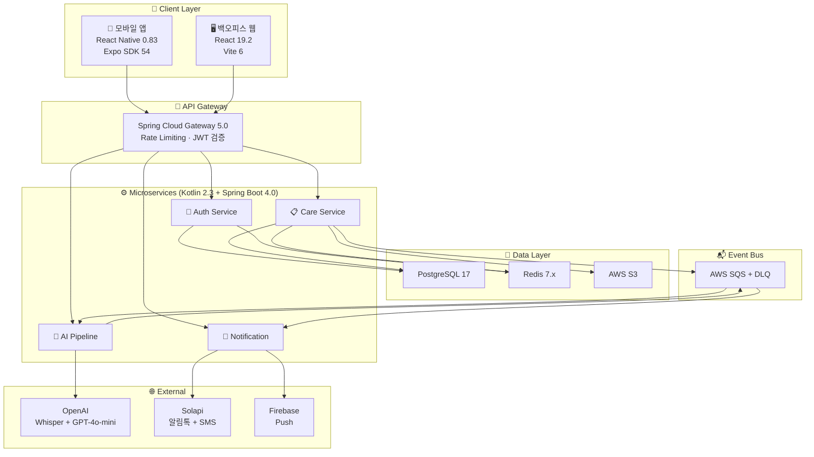

# 보듬 기술 스택 명세서 v0.0.1

> **프로젝트**: 보듬 (Bodeum) — AI 기반 제로타이핑 돌봄 기록 B2B SaaS
> **기준 문서**: `보듬_PRD_v0.1.0.md`, `보듬_아키텍처_설계서_v0.0.1.md`
> **작성일**: 2026-03-18
> **버전 기준**: 2026년 3월 시점 최신 안정 릴리스
> **관련 문서**: `보듬_코드컨벤션_v0.0.1.md` (코딩 규칙 및 컨벤션 링크)

---

## 목차

1. [기술 스택 전체 지도](#1-기술-스택-전체-지도)
2. [Backend](#2-backend)
3. [Frontend — Web (백오피스/어드민)](#3-frontend--web-백오피스어드민)
4. [Frontend — Mobile (요양보호사 앱)](#4-frontend--mobile-요양보호사-앱)
5. [디자인 시스템 & UI 라이브러리](#5-디자인-시스템--ui-라이브러리)
6. [데이터베이스 & 캐시](#6-데이터베이스--캐시)
7. [AI / ML 파이프라인](#7-ai--ml-파이프라인)
8. [Infrastructure & DevOps](#8-infrastructure--devops)
9. [외부 서비스 연동](#9-외부-서비스-연동)
10. [다국어(i18n) & 날짜/시간](#10-다국어i18n--날짜시간)
11. [코드 품질 & 린팅 도구](#11-코드-품질--린팅-도구)
12. [버전 호환성 매트릭스](#12-버전-호환성-매트릭스)
13. [개발 환경 구성](#13-개발-환경-구성)
14. [2026 기술 트렌드 분석](#14-2026-기술-트렌드-분석)

---

## 1. 기술 스택 전체 지도



### 전체 기술 스택 요약

| 영역 | 기술 | 버전 | 한줄 요약 |
|:----:|------|:----:|----------|
| **Language** | Kotlin | 2.3.20 | Backend 전체, K2 컴파일러 기본 |
| | TypeScript | 5.8+ | Frontend 전체 (Web + App) |
| **Backend** | Spring Boot | 4.0.3 | MSA 프레임워크, Spring Framework 7 기반 |
| | Spring Cloud Gateway | 5.0.1 | API Gateway, 라우팅/인증/Rate Limit |
| | Spring Cloud | 2025.1 | Config, Feign, Circuit Breaker |
| | Spring AI | 1.0.x | OpenAI 통합 추상화 |
| **Frontend (Web)** | React | 19.2.4 | 백오피스/어드민 SPA |
| | Vite | 6.x | 빌드 도구, 밀리초 HMR |
| | TanStack Query | v5 | 서버 상태 관리 |
| | Zustand | 5.x | 클라이언트 상태 관리 |
| **Frontend (App)** | React Native | 0.83 | 요양보호사 모바일 앱 |
| | Expo SDK | 54 | 네이티브 기능, 빌드, OTA |
| | Expo Router | v6 | 파일 기반 라우팅 |
| **UI/Design** | shadcn/ui | latest | Web 컴포넌트 (Radix 기반) |
| | Tailwind CSS | 4.x | Web 유틸리티 스타일링 |
| | Gluestack UI | v3 | App 컴포넌트 (NativeWind 기반) |
| | NativeWind | 4.2+ | App Tailwind 스타일링 |
| **i18n** | react-i18next | 24.x | 다국어 (외국인 요양보호사 앱 UI) |
| | date-fns | latest | 날짜 포매팅, 타임존 변환 |
| **Database** | PostgreSQL | 17 | 주 데이터베이스, JSONB, TIMESTAMPTZ(UTC) |
| | Redis | 7.x | 캐시, OTP, Rate Limiting |
| **Build** | Gradle | 9.4.0 | Backend 모노레포 빌드 |
| **Infra** | AWS ECS Fargate | — | 1~2단계 컨테이너 |
| | AWS EKS | — | 3단계 Kubernetes |
| | AWS SQS | — | 비동기 이벤트 큐 |

---

## 2. Backend

### 2.1 Kotlin 2.3.20

```
┌─────────────────────────────────────────────────────┐
│  Kotlin 2.3.20  ·  JVM 21 LTS  ·  K2 컴파일러 기본   │
│  릴리스: 2026년 3월  ·  Gradle 9.3.0+ 호환           │
└─────────────────────────────────────────────────────┘
```

#### 왜 Kotlin인가?

| 채택 근거 | 설명 |
|----------|------|
| **Spring Boot 4.0 공식 지원** | Kotlin 2.2+ baseline. Spring Framework 7.0의 `kotlinx-serialization-json`, BeanRegistrar DSL 등 Kotlin 전용 기능 다수 |
| **Null-safety = 돌봄 데이터 무결성** | 어르신 돌봄 기록에서 null 관련 런타임 에러는 곧 서비스 장애. 컴파일 타임 null 체크가 안전망 역할 |
| **Coroutines = I/O 집약 최적** | AI Pipeline에서 OpenAI API 호출(Whisper STT → GPT 구조화), SQS 폴링 등이 모두 비동기 I/O. Coroutines가 스레드 대비 10배 이상 경량 |
| **K2 컴파일러 빌드 성능** | K1 대비 30~40% 빌드 시간 단축. 4개 마이크로서비스 모노레포의 CI 시간 절감에 직결 |
| **DSL 친화적 언어** | Kotlin JDSL, Spring Security DSL, Gradle Kotlin DSL 등 보듬이 사용하는 도구들이 모두 Kotlin DSL 기반 |
| **팀 전문성** | 25년차 아키텍트의 Kotlin/Spring 핵심 역량 활용 극대화 |

#### 왜 Java가 아닌가?

| 항목 | Java 21 | Kotlin 2.3 | 보듬 영향 |
|------|---------|-----------|---------|
| Null 처리 | Optional 또는 어노테이션 | **언어 수준 강제** | 돌봄 기록 필드 누락 방지 |
| 비동기 | Virtual Threads (Loom) | **Coroutines** | Spring AI, SQS 폴링에 코루틴이 더 자연스러움 |
| DSL | 어려움 | **네이티브 지원** | 쿼리 빌더, 보안 설정, 빌드 스크립트 |
| 코드량 | 상대적 장황 | **30~40% 적음** | 소규모 팀에서 생산성 핵심 |
| 데이터 클래스 | Record (제한적) | **data class** (copy, destructuring) | DTO 변환 편의 |

#### 주요 신규 기능 활용

**Name-based Destructuring** (Kotlin 2.3 안정화):

```kotlin
// 순서 무관한 안전한 구조 분해 → 도메인 객체 리팩터링 시 버그 방지
val (name = name, phone = phone) = caregiver
```

**K2 컴파일러**: 기본 활성. 빌드 성능 외에도 IDE 자동완성, 타입 추론 정확도 향상.

**개선된 JPA 플러그인**: `all-open`, `no-arg`의 Kotlin 2.3 호환성 강화로 Entity 클래스 작성이 자연스러워짐.

---

### 2.2 Spring Boot 4.0.3

```
┌─────────────────────────────────────────────────────┐
│  Spring Boot 4.0.3  ·  Spring Framework 7.0         │
│  릴리스: 2026년 2월  ·  Jakarta EE 11  ·  Jackson 3.x │
└─────────────────────────────────────────────────────┘
```

> 🔴 **Major Upgrade** — Spring Boot 3.x → 4.0 는 메이저 전환. 신규 프로젝트이므로 마이그레이션 부담 없이 채택 가능.

#### 왜 Spring Boot인가?

| 채택 근거 | 설명 |
|----------|------|
| **Kotlin과 최고의 호환** | Spring Framework 7.0에서 `kotlinx-serialization-json` 네이티브 지원, BeanRegistrar DSL, JSpecify nullability → Kotlin 개발자 경험 최상위 |
| **MSA 성숙 생태계** | Spring Cloud Gateway, Config, Circuit Breaker, OpenFeign 등 MSA에 필요한 모든 컴포넌트를 단일 생태계에서 해결 |
| **Spring Security** | 보듬의 4단계 인증(OTP → Device Trust → Biometric → Browser Trust)을 구현하기 위한 필터 체인 커스터마이즈가 용이 |
| **Spring AI 통합** | 1.0에서 OpenAI, Anthropic 등 AI 제공자 추상화를 공식 지원. 보듬 AI Pipeline의 핵심 |
| **엔터프라이즈 안정성** | B2B SaaS로서 장기 유지보수 필요. Spring의 하위 호환성 정책과 LTS 지원이 핵심 |

#### 왜 다른 프레임워크가 아닌가?

| 프레임워크 | 장점 | 보듬에 부적합한 이유 |
|-----------|------|-------------------|
| Ktor | 순수 Kotlin, 경량 | MSA 생태계 미성숙, Security/Cloud 컴포넌트 부족 |
| Quarkus | GraalVM 네이티브, 빠른 시작 | Kotlin 지원 불안정, Spring 생태계 호환성 미흡 |
| Micronaut | AOT 컴파일, 빠른 시작 | Spring Cloud 대비 클라우드 생태계 부족 |

#### Spring Framework 7.0 핵심 변경

| 변경 사항 | 보듬 영향 | 적용 전략 |
|----------|---------|----------|
| `kotlinx-serialization-json` 지원 | Jackson 대체 가능 | 1단계: Jackson 3.x 기본, AI Pipeline부터 점진 전환 |
| BeanRegistrar DSL | 함수형 빈 등록 | 테스트 환경 활용 |
| JSpecify nullability | Kotlin-Java 상호운용 개선 | 서드파티 Java 라이브러리 호출 시 혜택 |
| Jackson 3.x (`tools.jackson`) | 패키지 변경 | 신규 프로젝트이므로 직접 3.x 사용 |

#### Spring Security 7.0

보듬의 "앱이 곧 열쇠" 인증 아키텍처를 Spring Security Lambda DSL로 구현:

```kotlin
@Bean
fun securityFilterChain(http: HttpSecurity): SecurityFilterChain {
    http {
        authorizeHttpRequests {
            authorize("/auth/otp/**", permitAll)
            authorize("/auth/web/request", permitAll)
            authorize("/admin/**", hasRole("ADMIN"))
            authorize("/centers/*/records/*/confirm", hasRole("DIRECTOR"))
            authorize(anyRequest, authenticated)
        }
        addFilterBefore<UsernamePasswordAuthenticationFilter>(JwtAuthenticationFilter(jwtProvider))
        addFilterAfter<JwtAuthenticationFilter>(DeviceTrustFilter(trustedDeviceRepository))
    }
    return http.build()
}
```

---

### 2.3 Spring Cloud 2025.1

| 컴포넌트 | 버전 | 채택 근거 |
|---------|:----:|----------|
| **Gateway** | 5.0.1 | 단일 진입점 라우팅, Redis 기반 Rate Limiting으로 OTP 무차별 대입 방지 |
| **Config** | — | AWS Parameter Store 연동으로 시크릿 중앙 관리. 환경별 설정 분리 |
| **OpenFeign** | — | 서비스 간 동기 호출 (제한적). 선언적 HTTP 클라이언트로 보일러플레이트 제거 |
| **Circuit Breaker** | — | Resilience4j 기반. OpenAI API 장애 시 AI Pipeline 격리, 폴백 응답 |

#### Gateway 라우팅 설정

```yaml
spring:
  cloud:
    gateway:
      routes:
        - id: auth-service
          uri: lb://auth-service
          predicates: [ Path=/auth/** ]
          filters:
            - name: RequestRateLimiter
              args:
                redis-rate-limiter: { replenishRate: 5, burstCapacity: 10 }

        - id: care-service
          uri: lb://care-service
          predicates: [ "Path=/centers/**, /visits/**, /clients/**, /caregivers/**" ]
          filters: [ JwtAuthenticationFilter ]

        - id: ai-pipeline
          uri: lb://ai-pipeline-service
          predicates: [ Path=/ai/** ]
          filters:
            - JwtAuthenticationFilter
            - name: RequestRateLimiter
              args:
                redis-rate-limiter: { replenishRate: 10, burstCapacity: 20 }
```

---

### 2.4 Gradle 9.4.0

| 채택 근거 | 설명 |
|----------|------|
| **Configuration Cache** | Preferred Mode 기본 활성. 모노레포 6개 모듈 반복 빌드 시 설정 단계 캐싱으로 CI 속도 대폭 향상 |
| **Kotlin 2 + Gradle 9** | K2 컴파일러와 Gradle 9의 조합으로 `build.gradle.kts` 파싱 속도 개선 |
| **Java 26 지원** | 향후 JDK 업그레이드 대비 |
| **Maven 대비 우위** | Kotlin DSL 네이티브, 병렬 빌드, 증분 빌드, 빌드 캐시 등 모노레포에 필수적인 기능 |

```kotlin
// settings.gradle.kts — 보듬 모노레포 구성
rootProject.name = "bodeum"

include(
    ":backend:shared-kernel",
    ":backend:auth-service",
    ":backend:care-service",
    ":backend:ai-pipeline-service",
    ":backend:notification-service",
    ":backend:api-gateway"
)
```

---

### 2.5 데이터 액세스: Spring Data JPA + Kotlin JDSL

#### 왜 Kotlin JDSL인가? (QueryDSL 대체)

2026년 Kotlin 프로젝트에서 가장 주목할 트렌드. LINE이 오픈소스로 유지하며 활발히 개발 중이다.

| 비교 항목 | QueryDSL | Kotlin JDSL | 판정 |
|----------|----------|-------------|:----:|
| 메타모델 생성 | Q클래스 필요 | **불필요** | ✅ JDSL |
| 어노테이션 프로세서 | kapt/KSP 필수 | **없음** | ✅ JDSL |
| K2 컴파일러 호환 | kapt는 K2와 충돌 위험 | **문제없음** | ✅ JDSL |
| 빌드 시간 영향 | 있음 (코드 생성) | **없음** | ✅ JDSL |
| Kotlin 친화성 | Java 기반 API | **Kotlin DSL 네이티브** | ✅ JDSL |
| 타입 안전성 | 컴파일 타임 (Q클래스) | DSL 기반 (프로퍼티 참조) | 무승부 |
| 생태계 성숙도 | 오래됨, 업데이트 느림 | 활발 (LINE 주도) | ✅ JDSL |

```kotlin
// 돌봄 기록 동적 검색 쿼리
val query = jpql {
    select(entity(CareRecord::class))
        .from(entity(CareRecord::class))
        .whereAnd(
            path(CareRecord::centerId).eq(centerId),
            path(CareRecord::status).`in`(CareRecordStatus.DRAFT, CareRecordStatus.SUBMITTED),
            path(CareRecord::visitDate).between(startDate, endDate)
        )
        .orderBy(path(CareRecord::visitDate).desc())
}
```

---

## 3. Frontend — Web (백오피스/어드민)

### 3.1 React 19.2.4

```
┌─────────────────────────────────────────────────────┐
│  React 19.2.4  ·  Vite 6.x  ·  TypeScript 5.8+     │
│  릴리스: 2026년 1월                                   │
└─────────────────────────────────────────────────────┘
```

#### 왜 React인가?

| 채택 근거 | 설명 |
|----------|------|
| **압도적 생태계** | UI 라이브러리(shadcn/ui), 상태 관리(Zustand, TanStack Query), 폼(React Hook Form) 등 B2B 백오피스에 필요한 모든 도구가 React 생태계에 최적화 |
| **TypeScript 통합** | React 19에서 제네릭 컴포넌트, 개선된 타입 추론 등 TS 지원이 가장 성숙 |
| **React 19 Actions** | `useActionState`, `useFormStatus`로 백오피스의 기록 확정/반려, 기관 승인 등 폼 액션을 선언적으로 처리 |
| **인력 수급** | 한국 프론트엔드 시장에서 React 개발자 풀이 가장 넓음 (채용 유리) |
| **팀 전문성** | 아키텍트의 React 경험 활용 |

#### 왜 Vue.js가 아닌가?

| 항목 | React 19 | Vue 3 | 보듬 판정 |
|------|---------|-------|:-------:|
| B2B 대시보드 생태계 | shadcn/ui, Tremor, TanStack Table | Vuetify, PrimeVue | React ✅ |
| 상태 관리 | Zustand + TanStack Query (성숙) | Pinia (성숙) | 무승부 |
| 타입 안전 컴포넌트 | 네이티브 TSX | `<script setup>` + defineProps | React ✅ |
| 모바일 코드 공유 | **React Native와 타입/로직 공유** | 별도 프레임워크 필요 | React ✅ |
| 커뮤니티 크기 | 압도적 | 크지만 상대적으로 작음 | React ✅ |

> 핵심 근거: **React Native와 Web이 TypeScript 타입, API 클라이언트, 비즈니스 로직을 모노레포 내에서 공유**할 수 있다는 점이 결정적. Vue를 선택하면 Web/App 간 코드 공유가 불가능해진다.

#### React 19 핵심 기능 활용

```tsx
// Actions: 돌봄 기록 확정 폼 액션
function ConfirmRecordButton({ recordId }: { recordId: number }) {
    const [state, formAction, isPending] = useActionState(
        async (_prev: unknown, _formData: FormData) => {
            return await confirmCareRecord(recordId)
        },
        null
    )

    return (
        <form action={formAction}>
            <Button type="submit" disabled={isPending}>
                {isPending ? '확정 처리 중...' : '기록 확정'}
            </Button>
        </form>
    )
}
```

### 3.2 상태 관리 전략

| 상태 유형 | 도구 | 채택 근거 | 보듬 활용 |
|----------|------|----------|---------|
| **서버 상태** | TanStack Query v5 | 캐싱/무효화/폴링/무한스크롤 내장. Redux/RTK Query 대비 보일러플레이트 90% 감소 | 돌봄 기록 목록, 대시보드 데이터 |
| **클라이언트 상태** | Zustand 5.x | 번들 크기 1.1KB. Redux 대비 설정 코드 80% 감소. React 19 `useSyncExternalStore` 기반 | 인증 토큰, 센터 선택, UI 토글 |
| **URL 상태** | React Router 7.x | 검색 필터/페이지네이션을 URL에 반영 → 북마크/공유 가능 | 기록 검색 필터, 페이지 |

```typescript
// TanStack Query: 돌봄 기록 무한 스크롤
const { data, fetchNextPage, hasNextPage } = useInfiniteQuery({
    queryKey: ['careRecords', centerId, filters],
    queryFn: ({ pageParam = 0 }) =>
        fetchCareRecords({ centerId, ...filters, page: pageParam }),
    getNextPageParam: (lastPage) => lastPage.nextCursor,
    staleTime: 30_000,
})
```

### 3.3 Vite 6.x

| 채택 근거 | 설명 |
|----------|------|
| **밀리초 HMR** | Webpack 대비 10~100배 빠른 개발 서버 시작 및 핫 리로드 |
| **ESM 네이티브** | 번들 없이 개발 → 대규모 프로젝트에서도 즉각 반영 |
| **Environment API** | 6.x에서 도입. 개발/스테이징/프로덕션 환경별 설정 세분화 |
| **React 19 완전 호환** | `@vitejs/plugin-react` 공식 지원 |

---

## 4. Frontend — Mobile (요양보호사 앱)

### 4.1 React Native 0.83

```
┌─────────────────────────────────────────────────────┐
│  React Native 0.83  ·  New Architecture 기본 활성     │
│  Expo SDK 54  ·  Router v6  ·  React 19.2 통합       │
│  릴리스: 2025년 12월                                  │
└─────────────────────────────────────────────────────┘
```

#### 왜 React Native인가?

| 채택 근거 | 설명 |
|----------|------|
| **Web과 코드 공유** | React 기반이므로 TypeScript 타입, API 클라이언트, 비즈니스 로직을 Web 백오피스와 모노레포 내에서 공유. 별도 네이티브 팀 불필요 |
| **New Architecture 성능** | 0.83에서 기본 활성. Cold start 43% 단축, 렌더링 39% 향상 → 고령 요양보호사의 UX 핵심 |
| **Expo 생태계** | EAS Build(클라우드 빌드), EAS Update(OTA 배포)로 소규모 팀에서도 iOS/Android 동시 배포 가능 |
| **단일 팀 운영** | 1~3명의 초기 팀에서 iOS/Android 네이티브를 각각 개발하는 것은 비현실적. RN으로 단일 코드베이스 운영 |

#### 왜 Flutter가 아닌가?

| 항목 | React Native 0.83 | Flutter | 보듬 판정 |
|------|------------------|---------|:-------:|
| Web 코드 공유 | **React 기반 = Web과 직접 공유** | Dart ≠ TypeScript, 별도 코드 | RN ✅ |
| 팀 역량 | React/TS 경험 활용 | Dart 별도 학습 필요 | RN ✅ |
| 렌더링 | Fabric (네이티브 UI) | Skia (자체 렌더링) | 무승부 |
| 패키지 생태계 | npm (거대) | pub.dev (성장 중) | RN ✅ |
| OTA 업데이트 | **EAS Update 지원** | 네이티브 코드 변경 시 불가 | RN ✅ |

#### New Architecture 성능 벤치마크

| 항목 | Legacy Bridge | New Architecture | 개선율 |
|------|:------------:|:----------------:|:------:|
| Cold Start | 기준 | — | **43% 단축** |
| 렌더링 | 기준 | — | **39% 향상** |
| 메모리 | 기준 | — | **~20% 감소** |
| JS↔Native 통신 | Bridge (비동기, 직렬화) | JSI (동기, 직접 호출) | **지연 최소화** |

> 보듬의 핵심 사용자인 요양보호사는 고령층이 많아, 앱 시작 속도와 UI 반응성이 서비스 채택률을 좌우한다. "보듬 앱이 곧 열쇠" 전략에서 43% cold start 개선은 결정적이다.

### 4.2 Expo SDK 54 + Router v6

| 채택 근거 | 설명 |
|----------|------|
| **EAS Update (OTA)** | 앱스토어 심사 없이 JS 번들 즉시 배포. AI 프롬프트 튜닝, UI 수정 등을 당일 배포 |
| **EAS Build** | 로컬 빌드 환경 없이 클라우드에서 iOS/Android 빌드. Mac 없이도 iOS 빌드 가능 |
| **파일 기반 라우팅** | Expo Router v6로 화면 구조를 디렉터리로 관리. Next.js App Router와 동일한 멘탈 모델 |
| **네이티브 모듈** | `expo-av`(녹음), `expo-local-authentication`(생체인증), `expo-notifications`(푸시) 등 보듬 핵심 기능을 Expo 모듈로 해결 |

#### 앱 화면 구조 (Expo Router v6)

```
app/
├── (auth)/
│   ├── login.tsx              # SMS OTP 로그인
│   └── biometric.tsx          # 생체인증 / PIN
├── (main)/
│   ├── _layout.tsx            # 탭 네비게이션
│   ├── today.tsx              # 오늘의 방문 일정 (F-APP-001)
│   ├── record/
│   │   ├── [visitId].tsx      # 음성 녹음 → 기록 생성 (F-APP-002)
│   │   └── edit/[id].tsx      # 초안 수정 (F-APP-003)
│   ├── history.tsx            # 기록 이력 (F-APP-004)
│   └── settings.tsx           # 설정
├── (director)/
│   └── approve.tsx            # 웹 로그인 승인 (push)
└── _layout.tsx
```

#### 네이티브 기능 매핑

| 보듬 기능 | Expo 모듈 | PRD 참조 |
|----------|----------|---------|
| 음성 녹음 | `expo-av` | F-APP-002 |
| 생체인증 | `expo-local-authentication` | 인증 아키텍처 |
| 푸시 알림 | `expo-notifications` + FCM | F-APP-006 |
| 위치 (2단계) | `expo-location` | F-GEO-001 |
| 보안 저장소 | `expo-secure-store` | JWT/디바이스 ID |
| 카메라 (향후) | `expo-camera` | 확장 기능 |

---

## 5. 디자인 시스템 & UI 라이브러리

### 5.1 Web — shadcn/ui + Tailwind CSS 4 + Tremor

```
┌──────────────────────────────────────────────────────┐
│  Web 디자인 스택                                       │
│                                                       │
│  ┌─────────────────┐  ┌───────────────┐              │
│  │   shadcn/ui     │  │    Tremor     │              │
│  │  (범용 컴포넌트)  │  │ (차트/대시보드) │              │
│  └────────┬────────┘  └───────┬───────┘              │
│           │                    │                      │
│  ┌────────▼────────────────────▼───────┐             │
│  │          Radix UI Primitives        │             │
│  │       (접근성 · 키보드 네비게이션)      │             │
│  └────────────────┬────────────────────┘             │
│                   │                                   │
│  ┌────────────────▼────────────────────┐             │
│  │        Tailwind CSS v4              │             │
│  │     (유틸리티 스타일링 엔진)           │             │
│  └─────────────────────────────────────┘             │
└──────────────────────────────────────────────────────┘
```

#### shadcn/ui

| 채택 근거 | 설명 |
|----------|------|
| **2026년 React 업계 표준** | GitHub 75,000+ 스타. 신규 React 프로젝트의 사실상 기본 선택 |
| **소유권 100%** | 컴포넌트를 프로젝트에 복사-붙여넣기. npm 의존성이 아닌 소스 코드 소유 → 커스터마이징 자유도 최대 |
| **Radix UI 기반** | WCAG 2.1 접근성, 키보드 네비게이션이 기본 내장. B2B SaaS에서 접근성은 필수 |
| **Tailwind CSS 네이티브** | 유틸리티 클래스로 일관된 디자인 토큰 관리. 별도 CSS 파일 불필요 |
| **Visual Builder (2026.02)** | shadcn/ui의 2026년 2월 업데이트로 시각적 컴포넌트 빌더 제공. 디자이너-개발자 협업 효율 |

#### 왜 MUI/Ant Design이 아닌가?

| 항목 | shadcn/ui | MUI (Material) | Ant Design | 보듬 판정 |
|------|----------|----------------|-----------|:-------:|
| 번들 크기 | **최소** (필요한 것만 복사) | 큼 (tree-shaking 제한적) | 큼 | shadcn ✅ |
| 커스터마이징 | **소스 코드 직접 수정** | 테마 오버라이드 (복잡) | 테마 오버라이드 | shadcn ✅ |
| 디자인 독립성 | **고유 디자인 가능** | Material Design 종속 | Ant Design 종속 | shadcn ✅ |
| 접근성 | Radix 기반 (최상) | 양호 | 보통 | shadcn ✅ |
| Tailwind 호환 | **네이티브** | CSS-in-JS (Emotion) | Less/CSS Module | shadcn ✅ |
| 2026 트렌드 | ⬆️ 급상승 | → 유지 | ⬇️ 하락 | shadcn ✅ |

#### Tailwind CSS v4

| 채택 근거 | 설명 |
|----------|------|
| **CSS-first 설정** | v4에서 `tailwind.config.js` 대신 CSS 파일로 설정. 빌드 체인 단순화 |
| **Lightning CSS 엔진** | Rust 기반 빌드로 PostCSS 대비 10배 빠른 빌드 |
| **Design Token 관리** | CSS 변수 기반 테마 시스템으로 보듬 브랜드 컬러, 간격, 타이포그래피 일관성 보장 |
| **산업 표준** | 2026년 프론트엔드 스타일링의 사실상 표준. 개발자 채용 시 러닝 커브 최소화 |

```css
/* Tailwind v4: CSS 기반 테마 설정 */
@theme {
  --color-bodeum-primary: oklch(0.65 0.18 250);
  --color-bodeum-secondary: oklch(0.80 0.10 160);
  --color-bodeum-warm: oklch(0.75 0.12 50);
  --font-sans: 'Pretendard', sans-serif;
  --radius-card: 0.75rem;
}
```

#### Tremor — 대시보드 전용

| 채택 근거 | 설명 |
|----------|------|
| **분석 대시보드 특화** | KPI 카드, 차트(Line/Bar/Area/Donut), 데이터 테이블 등 35+ 전용 컴포넌트 |
| **Radix + Recharts 기반** | shadcn/ui와 동일한 프리미티브 → 디자인 일관성 |
| **Tailwind CSS 스타일링** | 기존 스타일 시스템과 완벽 호환 |
| **보듬 활용** | 2단계 분석 대시보드(F-DASH-001), 기관별 KPI, AI 초안 채택률 시각화 |

```tsx
// Tremor: 보듬 기관 대시보드 KPI 카드
import { Card, Metric, Text, AreaChart } from '@tremor/react'

function CenterDashboard({ centerId }: { centerId: number }) {
    const { data } = useDashboardQuery(centerId)
    return (
        <div className="grid grid-cols-3 gap-4">
            <Card>
                <Text>오늘 방문</Text>
                <Metric>{data.todayVisits}</Metric>
            </Card>
            <Card>
                <Text>AI 초안 채택률</Text>
                <Metric>{data.adoptionRate}%</Metric>
            </Card>
            <Card>
                <Text>미제출 기록</Text>
                <Metric>{data.pendingRecords}</Metric>
            </Card>
        </div>
    )
}
```

---

### 5.2 App — Gluestack UI v3 + NativeWind

```
┌──────────────────────────────────────────────────────┐
│  App 디자인 스택                                       │
│                                                       │
│  ┌─────────────────────────────────┐                 │
│  │       Gluestack UI v3          │                 │
│  │   (30+ RN 컴포넌트, 복사 방식)   │                 │
│  └──────────────┬──────────────────┘                 │
│                 │                                     │
│  ┌──────────────▼──────────────────┐                 │
│  │        NativeWind 4.2+         │                 │
│  │  (Tailwind CSS → React Native)  │                 │
│  └──────────────┬──────────────────┘                 │
│                 │                                     │
│  ┌──────────────▼──────────────────┐                 │
│  │  Expo SDK 54 · New Architecture │                 │
│  └─────────────────────────────────┘                 │
└──────────────────────────────────────────────────────┘
```

#### Gluestack UI v3

| 채택 근거 | 설명 |
|----------|------|
| **shadcn/ui의 RN 버전** | 동일한 "복사-붙여넣기" 철학. 컴포넌트 소스 코드를 프로젝트에 직접 복사 → 100% 제어권 |
| **NativeWind 기반** | Tailwind CSS 클래스를 RN에서 사용. Web과 동일한 디자인 토큰/스타일링 멘탈 모델 |
| **New Architecture 호환** | Expo SDK 54 + RN 0.83 New Architecture에 완전 호환 |
| **Web/App 디자인 일관성** | Web(shadcn/ui + Tailwind)과 App(Gluestack + NativeWind)이 동일한 Tailwind 유틸리티 클래스 사용 → 디자인 토큰 공유 |

#### 왜 React Native Paper/Wix UI가 아닌가?

| 항목 | Gluestack UI v3 | RN Paper | Wix RNUI |
|------|----------------|----------|----------|
| 스타일링 | **NativeWind (Tailwind)** | 자체 테마 시스템 | 자체 시스템 |
| Web 디자인 일관성 | **Tailwind 공유** | 별도 | 별도 |
| 커스터마이징 | **소스 복사, 자유도 최대** | 테마 오버라이드 | 프로퍼티 기반 |
| 번들 크기 | **최소 (필요한 것만)** | 중간 | 큼 (60+) |
| Material 종속 | **없음** | Material Design 종속 | 없음 |

#### NativeWind 4.2+

| 채택 근거 | 설명 |
|----------|------|
| **Web/App 통합 스타일링** | Tailwind CSS 클래스를 React Native에서 사용. `className="bg-white p-4 rounded-xl"` 으로 동일한 코드 |
| **AOT 컴파일** | 런타임이 아닌 빌드 타임에 스타일 컴파일 → Bridge 통신 비용 제거 |
| **Expo SDK 54 호환** | NativeWind 4.2.0+에서 Expo SDK 54 + Reanimated v4 공식 지원 |

```tsx
// NativeWind: Web과 동일한 Tailwind 클래스 사용
function VisitCard({ visit }: { visit: Visit }) {
    return (
        <View className="bg-white rounded-xl p-4 mb-3 shadow-sm">
            <Text className="text-lg font-bold text-gray-900">
                {visit.clientName}
            </Text>
            <Text className="text-sm text-gray-500 mt-1">
                {visit.scheduledTime}
            </Text>
            <View className="flex-row mt-3 gap-2">
                <Badge className="bg-bodeum-primary/10">
                    <Text className="text-bodeum-primary text-xs">
                        {visit.serviceType}
                    </Text>
                </Badge>
            </View>
        </View>
    )
}
```

### 5.3 디자인 시스템 일관성 매트릭스

| 항목 | Web (백오피스) | App (모바일) | 공유 방식 |
|------|:------------:|:----------:|----------|
| 스타일링 엔진 | Tailwind CSS v4 | NativeWind 4.2 | **동일 유틸리티 클래스** |
| 컴포넌트 라이브러리 | shadcn/ui | Gluestack UI v3 | **동일 복사 철학** |
| 프리미티브 | Radix UI | — | 플랫폼별 |
| 대시보드 차트 | Tremor | — | Web 전용 |
| 디자인 토큰 | CSS Variables | NativeWind Theme | **Tailwind config 공유** |
| 아이콘 | Lucide React | Lucide React Native | **동일 아이콘 셋** |
| 폰트 | Pretendard | Pretendard | **동일 서체** |

---

## 6. 데이터베이스 & 캐시

### 6.1 PostgreSQL 17

| 채택 근거 | 설명 |
|----------|------|
| **JSONB = 유연한 돌봄 기록** | `ai_generated_draft` 필드를 JSONB로 저장. 신체/인지/정서/특이사항의 스키마 변경에 마이그레이션 없이 대응 |
| **JSON_TABLE() (v17 신규)** | JSONB를 관계형 테이블처럼 쿼리 → 돌봄 기록 분석 쿼리에 직접 활용 |
| **VACUUM 개선 (v17)** | `care_records` 같은 INSERT/UPDATE 집약 테이블의 dead tuple 정리 효율 대폭 향상 |
| **COPY 2배 향상 (v17)** | Excel/PDF 내보내기 시 대량 데이터 추출 속도 개선 |
| **AWS RDS 완전 지원** | 관리형 서비스로 운영 부담 최소화. 자동 백업, 멀티 AZ, Read Replica |
| **MySQL 대비** | JSONB 네이티브 지원, CTE(재귀 쿼리), Window Function 등 복잡한 집계 쿼리에 강점 |

```sql
-- PostgreSQL 17: JSON_TABLE로 돌봄 기록 분석
SELECT r.id, r.visit_date, jt.*
FROM care_records r,
     JSON_TABLE(r.ai_generated_draft, '$' COLUMNS (
         physical_care_note TEXT PATH '$.physical_care_note',
         cognitive_care_note TEXT PATH '$.cognitive_care_note',
         emotional_care_note TEXT PATH '$.emotional_care_note'
     )) AS jt
WHERE r.center_id = 1 AND r.status = 'CONFIRMED';
```

### 6.2 Redis 7.x

| 채택 근거 | 설명 |
|----------|------|
| **TTL 기반 만료 데이터** | OTP(3분), WebAuth(5분), Rate Limit(1분) 등 보듬의 인증 흐름이 모두 시간 제한 데이터 |
| **원자적 연산** | Rate Limiting 카운터, OTP 검증 횟수 추적에 INCR/EXPIRE 원자 조합 활용 |
| **AWS ElastiCache** | 관리형 서비스. 자동 장애 복구, 클러스터 모드 지원 |

| 키 패턴 | TTL | 용도 |
|---------|:---:|------|
| `otp:{phone}` | 3분 | SMS OTP 인증번호 |
| `web-auth:{requestId}` | 5분 | 웹 로그인 푸시 승인 대기 |
| `device-trust:{deviceId}` | 90일 | 디바이스 신뢰 세션 |
| `browser-trust:{hash}` | 14일 | 브라우저 신뢰 토큰 |
| `rate-limit:{ip}:{endpoint}` | 1분 | API Rate Limiting |
| `dashboard:{centerId}` | 5분 | 대시보드 집계 캐시 |

---

## 7. AI / ML 파이프라인

| 기술 | 채택 근거 | 역할 |
|------|----------|------|
| **OpenAI Whisper API** | 한국어 STT 정확도 최상위. 자체 호스팅 대비 인프라 부담 제거 | 음성 → 텍스트 |
| **OpenAI GPT-4o-mini** | 비용 효율적 구조화. GPT-4o 대비 80% 저렴하면서도 돌봄 기록 구조화에 충분한 성능 | 텍스트 → 4영역 기록 |
| **Spring AI 1.0** | AI 제공자 추상화. OpenAI → Anthropic/Ollama 전환 시 코드 변경 최소화 | API 클라이언트 |
| **AWS SQS + DLQ** | 비동기 파이프라인. STT/구조화 실패 시 DLQ로 격리 후 재처리 | 이벤트 큐 |

#### 왜 자체 호스팅 모델이 아닌가?

| 항목 | API 호출 (현재) | 자체 호스팅 | 보듬 판정 |
|------|:-------------:|:---------:|:-------:|
| 초기 비용 | **없음** | GPU 서버 필요 | API ✅ |
| 운영 부담 | **없음** | 모델 관리, 스케일링 | API ✅ |
| 한국어 성능 | Whisper large-v3 | 동일 가능 | 무승부 |
| 확장성 | 자동 | 직접 관리 | API ✅ |
| 전환 시점 | — | 3단계 (월 10만 건+) | — |

```kotlin
// Spring AI 추상화로 제공자 교체 용이
@Service
class CareRecordAiService(
    private val chatClient: ChatClient,
    private val audioClient: AudioClient
) {
    suspend fun transcribe(audioBytes: ByteArray): String =
        audioClient.transcribe(AudioTranscriptionRequest(audioBytes, "whisper-1")).text

    suspend fun structurize(rawText: String, context: ClientContext): CareRecordDraft {
        val prompt = buildPrompt(rawText, context)
        return chatClient.call(prompt).let { parseStructuredResponse(it) }
    }
}
```

---

## 8. Infrastructure & DevOps

### 8.1 AWS 클라우드 서비스

| 서비스 | 채택 근거 | 단계 |
|--------|----------|:----:|
| **ECS Fargate** | 서버리스 컨테이너. K8s 운영 부담 없이 MSA 배포. 1~3명 팀에 최적 | 1~2 |
| **EKS** | 트래픽 증가 시 HPA, Istio 등 고급 오케스트레이션 필요 시 전환 | 3 |
| **RDS PostgreSQL 17** | 관리형 DB. 자동 백업, 멀티 AZ, Read Replica | 전체 |
| **ElastiCache Redis** | 관리형 캐시. 자동 장애 복구, 클러스터 모드 | 전체 |
| **SQS + DLQ** | 관리형 큐. Kafka 대비 운영 부담 제로. DLQ로 실패 메시지 격리 | 전체 |
| **S3** | 음성 파일 저장, 내보내기 파일, 정적 자산. 무제한 확장 | 전체 |
| **CloudFront** | CDN. 웹 정적 자산 글로벌 배포 | 전체 |
| **ALB** | 서비스 라우팅, 헬스 체크, SSL 종료 | 전체 |
| **ECR** | Docker 이미지 레지스트리. ECS/EKS 배포 파이프라인 | 전체 |
| **CloudWatch** | 중앙 로그, 메트릭, 알람. PagerDuty 연동 | 전체 |
| **Parameter Store** | 설정/시크릿 중앙 관리. 환경별 분리 | 전체 |
| **WAF** | 웹 방화벽. SQL Injection, XSS 등 OWASP Top 10 방어 | 전체 |
| **KMS** | 암호화 키 관리. RDS 암호화, S3 암호화 | 전체 |

#### 왜 SQS인가? (Kafka 대비)

| 항목 | AWS SQS | Apache Kafka | 보듬 판정 |
|------|---------|-------------|:-------:|
| 운영 부담 | **제로** (관리형) | 클러스터 관리 필요 | SQS ✅ |
| 비용 (소규모) | **종량제, 매우 저렴** | 최소 3 브로커 상시 비용 | SQS ✅ |
| DLQ | **네이티브 지원** | 직접 구현 | SQS ✅ |
| 메시지 순서 | FIFO 큐 옵션 | 파티션 내 보장 | 무승부 |
| 이벤트 리플레이 | ❌ | ✅ | Kafka ✅ |
| 처리량 (대규모) | 제한적 | 무제한 | Kafka ✅ |
| 전환 시점 | 1~2단계 | 3단계 검토 | — |

### 8.2 CI/CD

| 도구 | 채택 근거 |
|------|----------|
| **GitHub Actions** | GitHub 통합. 모노레포 path 필터로 변경된 서비스만 빌드. 무료 2,000분/월 |
| **Docker** | 컨테이너 표준. 로컬-CI-프로덕션 환경 동일성 보장 |
| **Gradle 9.4** | Configuration Cache로 CI 빌드 시간 대폭 단축 |
| **Vite 6** | Frontend 빌드. 프로덕션 번들 최적화 (tree-shaking, code splitting) |
| **EAS Build** | React Native 클라우드 빌드. Mac 없이 iOS 빌드 가능 |
| **Trivy** | 컨테이너 이미지 보안 스캔. CVE 탐지 |
| **Flyway** | DB 마이그레이션. 버전 관리되는 스키마 변경 |

### 8.3 모니터링 / 관측성

| 도구 | 채택 근거 | 단계 |
|------|----------|:----:|
| **CloudWatch Logs** | AWS 네이티브 통합. ECS 로그 자동 수집 | 1~ |
| **CloudWatch Metrics + Alarms** | 인프라/앱 메트릭. PagerDuty 연동 알람 | 1~ |
| **Sentry** | 프론트엔드 에러 추적. 스택 트레이스, 사용자 세션 리플레이 | 1~ |
| **AWS X-Ray** | 분산 트레이싱. MSA 간 요청 흐름 시각화 | 2~ |
| **Micrometer + Prometheus** | 애플리케이션 메트릭. Spring Boot Actuator 연동 | 2~ |
| **Grafana** | 대시보드 시각화. Prometheus + CloudWatch 통합 뷰 | 2~ |

---

## 9. 외부 서비스 연동

| 서비스 | 제공사 | 채택 근거 | 단계 |
|--------|:-----:|----------|:----:|
| **Whisper API** | OpenAI | 한국어 STT 최고 정확도. 관리형 서비스 | 1~ |
| **GPT-4o-mini** | OpenAI | 비용 효율 구조화. GPT-4o 대비 80% 저렴 | 1~ |
| **Solapi 알림톡** | Solapi | 카카오톡 알림톡 단가 최저. REST API 간편 | 1~ |
| **Solapi SMS** | Solapi | 동일 제공사로 알림톡+SMS 통합 관리 | 1~ |
| **FCM** | Google | 무료 푸시 알림. iOS/Android 통합 | 1~ |
| **PG (결제)** | TBD | 토스페이먼츠 / NHN KCP 비교 후 선정 | 2 |
| **공단 엑셀 연동** | 건보공단 | 공단은 운영 데이터 API 미제공. 일정계획·청구내역·RFID 실적을 엑셀 다운로드/업로드 방식으로 양방향 연동 | 3 |
| **ERP 엑셀 호환** | 다수 | 패밀리케어·롱텀케어·케어포 등 주요 ERP 엑셀 양식 임포트/익스포트 호환 | 3 |

---

## 10. 다국어(i18n) & 날짜/시간

### 10.1 다국어 지원 (외국인 요양보호사 대응)

| 플랫폼 | 라이브러리 | 채택 근거 |
|--------|----------|----------|
| **App (RN)** | `react-i18next` + `i18next` 24.x | React 생태계 표준 i18n. Expo 완전 호환. 복수형/보간/네임스페이스 지원 |
| **App** | `expo-localization` | 기기 언어/지역 자동 감지. Expo SDK 54 내장 |
| **Web** | `react-i18next` | 앱과 동일 라이브러리로 번역 파일 구조 공유 |
| **Backend** | 자체 (messageKey 방식) | 에러 코드 + messageKey 반환 → 클라이언트에서 번역 |

**지원 언어 로드맵**:

| 단계 | 언어 | 범위 |
|:----:|------|------|
| 1단계 | 한국어 (기본) | 전체. i18n 인프라만 선행 구축 |
| 2단계 | + 영어, + 베트남어 | 앱 UI (외국인 요양보호사) |
| 3단계 | + 중국어 간체 | 앱 UI (조선족/중국인) |

> **핵심 원칙**: 업무 데이터(돌봄 기록, 알림톡, 상태변화기록지)는 항상 한국어. 다국어는 앱 UI 인터페이스에만 적용.

### 10.2 날짜/시간 라이브러리

| 플랫폼 | 라이브러리 | 채택 근거 |
|--------|----------|----------|
| **Frontend** | `date-fns` + `date-fns-tz` | 로케일별 날짜 포매팅, 타임존 변환. Tree-shakeable (Moment.js 대비 경량) |
| **Backend** | `java.time` (Kotlin 표준) | JDK 표준. `Instant`(UTC), `ZonedDateTime`(로케일) |

**타임존 전략**: DB(`TIMESTAMPTZ`, UTC) → Backend(`Instant`, UTC) → API(ISO 8601 + Offset) → Client(사용자 로케일 변환)

---

## 11. 코드 품질 & 린팅 도구

> 상세 컨벤션은 `보듬_코드컨벤션_v0.0.1.md` 참조

### 10.1 Backend (Kotlin)

| 도구 | 채택 근거 |
|------|----------|
| **Ktlint** | Kotlin 공식 스타일 자동 포매팅. IntelliJ 플러그인으로 즉각 피드백 |
| **Detekt** | 정적 코드 분석. 코드 스멜, 복잡도 탐지. Ktlint 규칙 통합 가능 |
| **JUnit 5 + MockK** | Kotlin 친화 테스트. `every { }`, `verify { }` DSL 기반 모킹 |
| **JaCoCo** | 테스트 커버리지 리포트. Domain 80%+, Service 70%+ 목표 |

### 10.2 Frontend (TypeScript)

| 도구 | 채택 근거 |
|------|----------|
| **Biome v2.3** | ESLint+Prettier 올인원 대체. Rust 기반 10~100배 빠른 린팅/포매팅. 2026년 신규 프로젝트 권장 |
| **ESLint** (react-hooks만) | Biome가 아직 완전 커버하지 못하는 `react-hooks/rules-of-hooks`, `exhaustive-deps` 규칙 보완 |
| **Vitest** | Vite 네이티브 테스트 러너. Jest 호환 API, ESM 완전 지원 |
| **Playwright** | E2E 테스트. Chromium/Firefox/WebKit 크로스 브라우저 |

### 10.3 공통

| 도구 | 채택 근거 |
|------|----------|
| **Husky** | Git hooks. pre-commit에서 린트/포매팅 자동 실행 |
| **lint-staged** | 스테이징된 파일만 린트 → CI 대기 없이 로컬에서 빠른 피드백 |
| **Conventional Commits** | 커밋 메시지 표준화. `feat:`, `fix:`, `refactor:` 등 자동 체인지로그 |

---

## 12. 버전 호환성 매트릭스

| 기술 | 버전 | 호환 요구사항 | 비고 |
|------|:----:|-------------|------|
| Kotlin | 2.3.20 | JVM 21, Gradle 9.3+ | K2 기본 |
| Spring Boot | 4.0.3 | Kotlin 2.2+, Java 17+, Jakarta EE 11 | SF 7.0 기반 |
| Spring Cloud | 2025.1 | Spring Boot 4.0.x | Gateway 5.0.1 |
| Gradle | 9.4.0 | Kotlin 2.x, Java 21+ | Config Cache |
| React | 19.2.4 | TypeScript 5.5+ | Actions, use() |
| React Native | 0.83 | React 19.2, Expo SDK 54 | New Arch 기본 |
| Expo SDK | 54 | RN 0.83, Router v6 | EAS Build/Update |
| TypeScript | 5.8+ | — | Strict Mode |
| PostgreSQL | 17 | AWS RDS 지원 | JSON_TABLE |
| Redis | 7.x | AWS ElastiCache 지원 | — |
| Tailwind CSS | 4.x | — | Lightning CSS |
| NativeWind | 4.2+ | Expo SDK 54, Reanimated v4 | AOT 컴파일 |
| shadcn/ui | latest | React 19, Tailwind v4 | Radix 기반 |
| Gluestack UI | v3 | RN 0.83, NativeWind 4.2 | 복사 방식 |
| Biome | 2.3.x | — | Rust 기반 |

---

## 13. 개발 환경 구성

### 12.1 필수 도구

| 도구 | 권장 버전 | 용도 |
|------|:--------:|------|
| JDK | 21 LTS (Temurin) | Kotlin/Spring 런타임 |
| Node.js | 22 LTS | React/RN 빌드, Biome |
| Docker Desktop | 최신 | 로컬 PostgreSQL, Redis, LocalStack |
| IntelliJ IDEA | 2026.1+ | Backend IDE (Kotlin 2.3 완전 지원) |
| VS Code / Cursor | 최신 | Frontend IDE (Biome 플러그인) |
| Android Studio | 최신 | RN Android 빌드/에뮬레이터 |
| Xcode | 16+ | RN iOS 빌드/시뮬레이터 |

### 12.2 로컬 개발 Docker Compose

```yaml
# docker-compose.dev.yml
services:
  postgres:
    image: postgres:17
    ports: ["5432:5432"]
    environment:
      POSTGRES_DB: bodeum
      POSTGRES_USER: bodeum
      POSTGRES_PASSWORD: local-dev
    volumes:
      - ./infra/db/init.sql:/docker-entrypoint-initdb.d/init.sql

  redis:
    image: redis:7-alpine
    ports: ["6379:6379"]

  localstack:
    image: localstack/localstack:latest
    ports: ["4566:4566"]
    environment:
      SERVICES: sqs,s3
```

### 12.3 모노레포 디렉터리 구조

```
bodeum/
├── backend/
│   ├── shared-kernel/         # 공유 도메인, DTO, 유틸
│   ├── auth-service/
│   ├── care-service/
│   ├── ai-pipeline-service/
│   ├── notification-service/
│   ├── api-gateway/
│   ├── build.gradle.kts       # 루트 빌드 (Ktlint, Detekt)
│   └── settings.gradle.kts
├── web/                        # React 백오피스/어드민
│   ├── src/
│   │   ├── components/ui/      # shadcn/ui 컴포넌트
│   │   └── ...
│   ├── biome.json
│   └── vite.config.ts
├── app/                        # React Native 모바일 앱
│   ├── app/
│   │   ├── (auth)/             # 공통 인증
│   │   ├── (caregiver)/        # 요양보호사 전용 탭
│   │   └── (director)/         # 원장님 전용 탭
│   ├── components/             # Gluestack UI 컴포넌트
│   ├── locales/                # 다국어 번역 파일 (ko/en/vi/zh-CN)
│   ├── i18n/                   # i18next 초기화
│   └── app.config.ts
├── packages/
│   └── shared-types/           # Web/App 공유 TypeScript 타입
├── infra/
│   ├── terraform/              # IaC
│   ├── docker/
│   └── db/
├── docs/                       # 기획/설계 문서
└── docker-compose.dev.yml
```

---

## 14. 2026 기술 트렌드 분석

### 13.1 Kotlin 생태계 성숙 — Java 의존도 탈피

K2 컴파일러 안정화, `kotlinx-serialization` 범용화, Kotlin JDSL 부상으로 2026년은 Kotlin 프로젝트에서 Java 기반 도구(QueryDSL, Jackson) 의존이 필수가 아닌 시대. 보듬은 이 흐름에 맞춰 **Kotlin-first** 전략을 채택한다.

### 13.2 Spring Boot 4.0 — 메이저 전환기의 신규 프로젝트 이점

Spring Boot 4.0은 역대 가장 큰 메이저 업그레이드(SF 7.0, Jakarta EE 11, Jackson 3.x). 기존 프로젝트는 마이그레이션 부담이 크지만, **보듬은 신규 프로젝트이므로 처음부터 4.0을 채택**하여 최신 기능을 마이그레이션 비용 없이 활용한다.

### 13.3 shadcn/ui + Tailwind v4 — 프론트엔드 디자인의 새 표준

MUI/Ant Design 중심이었던 React UI 생태계가 shadcn/ui(복사 방식, Radix 기반, Tailwind 스타일링)로 급속히 전환 중이다. 2026년 2월 Visual Builder 도입으로 디자이너-개발자 협업 효율도 대폭 개선되었다.

### 13.4 React Native New Architecture 필수화

RN 0.83에서 New Architecture가 기본 활성화됨에 따라, 구 Bridge 기반 개발은 사실상 지원 종료 수순이다. Gluestack UI v3 + NativeWind 4.2가 New Architecture에 완전 호환되어, 성능과 개발 편의성을 모두 확보한다.

### 13.5 Biome — ESLint+Prettier의 진화

Rust 기반 올인원 린터/포매터 Biome가 2026년 신규 프로젝트의 사실상 표준으로 자리잡았다. 10~100배 빠른 속도, 단일 설정 파일, 타입 인식 린팅(v2.0+)으로 ESLint+Prettier 조합을 대체한다.

### 13.6 서버리스 우선, 필요 시 Kubernetes

ECS Fargate로 시작하여 3단계에서 EKS로 전환하는 전략은 2026년 스타트업 생태계의 주류 패턴이다. 1~3명 팀에서 Kubernetes 운영 부담은 비현실적이다.

---

## 부록 A. 참조 문서

| 문서 | 버전 | 용도 |
|------|:----:|------|
| 보듬_PRD_v0.1.0.md | v0.1.0 | 제품 요구사항 정의서 (원천) |
| 보듬_아키텍처_설계서_v0.0.1.md | v0.0.1 | 아키텍처 설계 |
| 보듬_엔티티_명세서_v0.0.1.md | v0.0.1 | 엔티티 설계 |
| 보듬_API_명세서_v0.0.1.md | v0.0.1 | API 명세 |
| 보듬_도메인_용어사전_v0.0.1.md | v0.0.1 | 도메인 용어 |
| **보듬_코드컨벤션_v0.0.1.md** | **v0.0.1** | **코딩 규칙 · 컨벤션 링크** |
| **보듬_브랜드_가이드라인_v0.0.1.md** | **v0.0.1** | **컬러, 타이포, 로고, 톤앤보이스** |
| **보듬_설계보강_v0.0.1.md** | **v0.0.1** | **요양원, 원장앱, i18n, DB 글로벌** |

## 부록 B. 변경 이력

| 버전 | 날짜 | 변경 내용 |
|------|------|----------|
| v0.0.1 | 2026-03-18 | 최초 작성 — 채택 근거, 디자인 라이브러리, 코드 품질 도구 포함 |
| v0.0.1a | 2026-03-18 | 보강 — i18n/날짜 라이브러리 추가, 앱 디렉터리에 역할별 라우팅·locales 반영, 브랜드/설계보강 문서 참조 추가 |
