# 보듬(Bodeum) 아키텍처 설계서

> **문서 버전**: 0.0.1
> **작성일**: 2026-03-18
> **기반 문서**: 보듬_PRD_v0.1.0.md, 보듬_엔티티_명세서_v0.0.1.md, 보듬_API_명세서_v0.0.1.md
> **대상 범위**: 전체 시스템 (1단계 핵심 ~ 3단계 확장)
> **기술 스택**: Kotlin/Spring Cloud · React · React Native · PostgreSQL · AWS

---

## 1. 아키텍처 개요

### 1.1 아키텍처 스타일

보듬은 **Hexagonal Architecture(포트-어댑터) 기반 MSA**를 채택한다.

- **MSA**: 4개 핵심 서비스 + API Gateway로 분리. 서비스별 독립 배포·스케일링.
- **Hexagonal**: 각 서비스 내부는 Domain → Application → API → Infrastructure 계층으로 분리.
- **이벤트 기반 비동기**: AI Pipeline ↔ Care Service ↔ Notification Service 간 SQS 메시지 큐를 통한 비동기 통신.

### 1.2 설계 원칙

| 원칙 | 적용 |
|:---|:---|
| 단일 책임 | 서비스별 하나의 도메인 영역만 담당 |
| 느슨한 결합 | 서비스 간 비동기 이벤트(SQS)로 통신. 동기 호출 최소화 |
| 높은 응집 | 도메인 로직은 도메인 계층에 집중. 인프라 세부사항은 어댑터로 분리 |
| 보듬 앱이 곧 열쇠 | 모바일 앱이 전체 인증의 유일한 Authenticator |
| 고령 사용자 중심 | 프론트엔드 모든 의사결정에서 UX 단순성 최우선 |
| 글로벌 대응 설계 | DB는 UTC/E.164/UTF-8, 앱 UI만 다국어. 업무 데이터는 한국어 |

---

## 2. 시스템 구성도

### 2.1 전체 시스템 아키텍처

#### 2.1.1 1단계 아키텍처 (핵심)

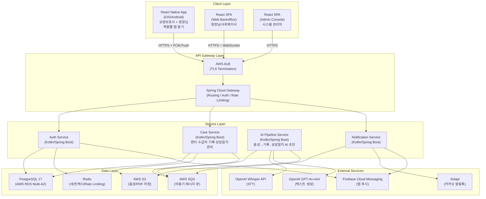

#### 2.1.2 2단계 아키텍처 (성장)

> 1단계 구조에서 **Payment Service** 추가, **Care Service 확장** (일정, 기초평가, 회의록, 근무일지), **AI Pipeline 확장** (회의록·기초평가 AI).

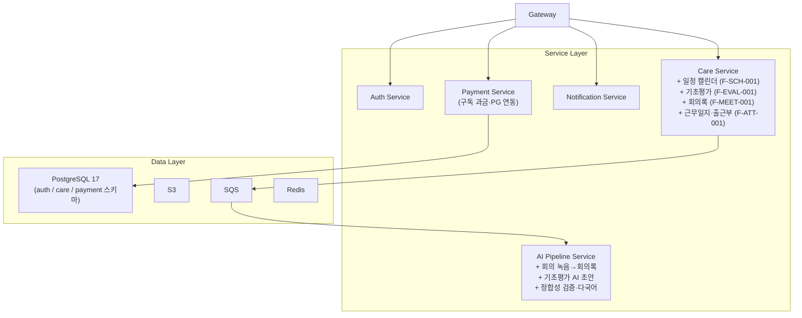

#### 2.1.3 3단계 아키텍처 (확장)

> **Integration Service** (공단 엑셀 연동), **Billing Service** (본인부담금), **Payroll Service** (독립 서비스) 추가. 인프라 EKS 전환.

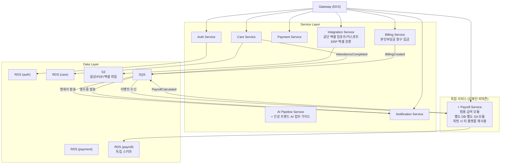

> **Payroll Service**는 Care/AI 서비스와 코드 의존성 없음. `AttendanceCompleted` 이벤트(SQS)만 수신하여 급여 계산. 별도 DB 스키마·별도 Git 모듈로 독립 배포. → ADR-006 참조.

### 2.2 모바일 앱 역할별 탭 구조

> **모바일 앱 역할별 분기**: Expo Router의 그룹 라우팅으로 역할별 탭 구조를 분리한다.
> - `(caregiver)/`: 홈, 녹음, 기록, 내정보 (4탭)
> - `(director)/`: 홈, 승인, 현황, 알림, 내정보 (5탭)
> - `_layout.tsx`에서 JWT의 `role` 클레임 기반 자동 분기. 원장님이 요양보호사 역할도 겸직할 경우 앱 내 역할 전환 지원.

---

### 2.3 인증 흐름 시퀀스 다이어그램

#### 요양보호사 — 최초 기기 등록

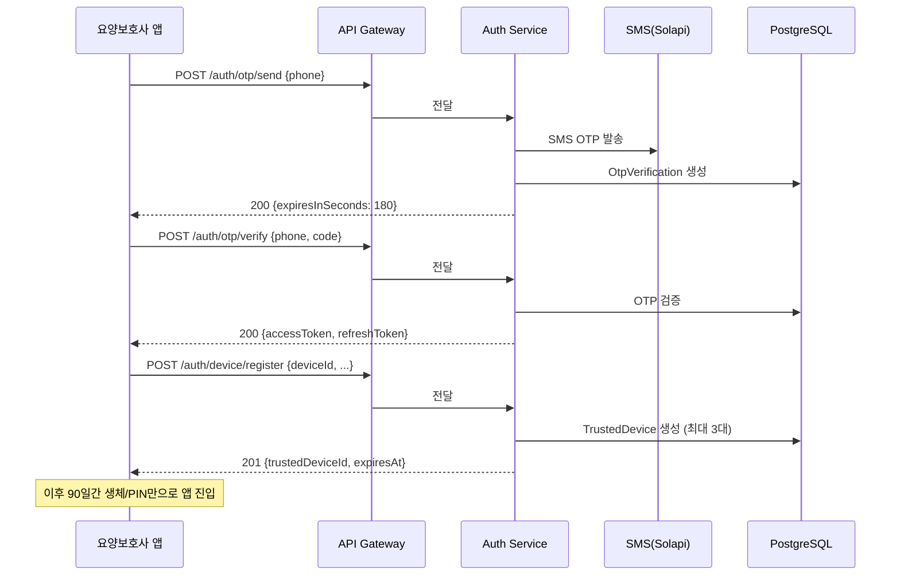

#### 원장님 — 웹 로그인 (앱 푸시 승인)

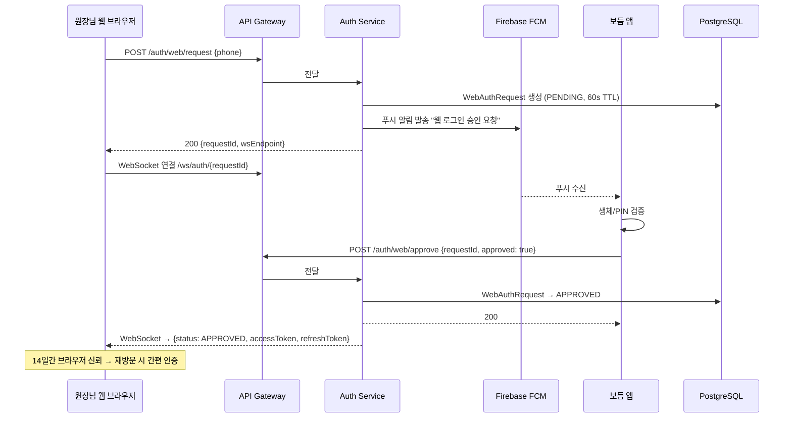

#### 어드민 — 2FA 로그인

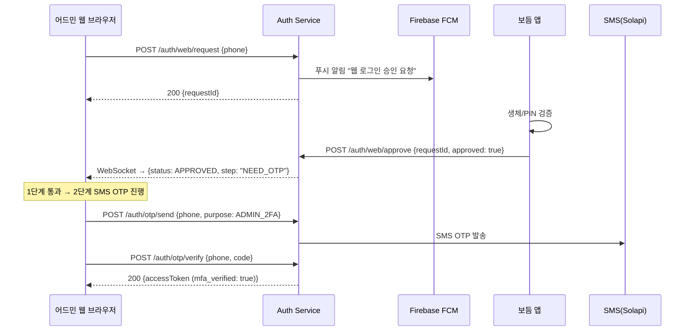

---

### 2.4 돌봄 기록 생성 플로우

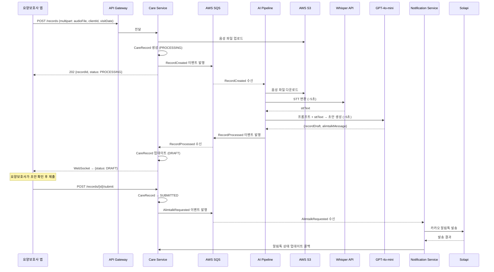

---

## 3. 서비스별 상세 설계

### 3.1 서비스 책임 매트릭스

| 서비스 | 도메인 | 엔티티 소유 | 외부 연동 |
|:---|:---|:---|:---|
| **Auth Service** | 인증·권한·기기 신뢰 | User, UserCenterRole, TrustedDevice, WebAuthRequest, OtpVerification, BrowserTrust | FCM, SMS(Solapi) |
| **Care Service** | 센터·수급자·기록·일정·평가·상담·근무 관리 (F-AI-007, F-SCH-001, F-EVAL-001, F-MEET-001, F-ATT-001) | Center, Client, Guardian, Assignment, CareRecord, AlimtalkLog, CounselJournal, Schedule, HealthEvaluation, MeetingMinutes, AttendanceLog | S3, SQS |
| **AI Pipeline** | 음성→텍스트 변환·생성, 상담일지(F-AI-007)·기초평가(F-EVAL-001)·회의록(F-MEET-001) AI 초안, AI 업무 가이드(F-ERP-004) | (없음 — stateless) | Whisper, GPT-4o-mini, S3, SQS |
| **Notification Service** | 알림 발송 | NotificationTemplate | Solapi, FCM, SQS |
| **Payment Service** | 구독 과금·결제 (2단계~) | Subscription, Payment | PG(토스페이먼츠/아임포트), SQS |
| **Integration Service** | 공단 엑셀 연동·ERP 호환 (F-ERP-001, 3단계) | ExcelIntegration, ExcelSyncLog | S3(엑셀 파일 저장) |
| **Billing Service** | 본인부담금 청구·입금 (F-ERP-002, 3단계) | SelfPaymentBilling | Solapi(영수증 알림톡), SQS |
| **Payroll Service** ⚡ | **범용 급여 모듈 (F-ERP-003, 도메인 비의존, 독립 배포)** | Payroll | Solapi(명세서 알림톡). Care Service의 AttendanceLog를 이벤트로 수신. **별도 DB 스키마·별도 Git 모듈. 피벗 시 타 플랫폼 재사용 가능.** |

### 3.2 서비스 내부 계층 구조 (Hexagonal)

각 서비스는 동일한 계층 구조를 따른다.

```
service-name/
├── domain/                # 도메인 계층 (순수 Kotlin, 외부 의존성 없음)
│   ├── model/             # Entity, Value Object, Enum
│   ├── repository/        # Repository 인터페이스 (Port)
│   ├── service/           # 도메인 서비스 (비즈니스 규칙)
│   └── event/             # 도메인 이벤트 정의
│
├── application/           # 애플리케이션 계층 (유스케이스 오케스트레이션)
│   ├── usecase/           # 유스케이스 인터페이스
│   ├── service/           # 유스케이스 구현 (@Service)
│   ├── dto/               # Command, Query DTO
│   └── port/              # 외부 서비스 포트 (인터페이스)
│
├── api/                   # API 계층 (인바운드 어댑터)
│   ├── controller/        # REST Controller
│   ├── dto/               # Request/Response DTO
│   ├── advice/            # ExceptionHandler
│   └── websocket/         # WebSocket Handler (Auth, Records)
│
└── infrastructure/        # 인프라 계층 (아웃바운드 어댑터)
    ├── persistence/        # JPA Repository 구현, Entity 매핑
    ├── external/           # 외부 API 클라이언트 (Whisper, Solapi 등)
    ├── messaging/          # SQS Producer/Consumer
    ├── storage/            # S3 클라이언트
    ├── config/             # Spring 설정
    └── security/           # JWT, RBAC 필터
```

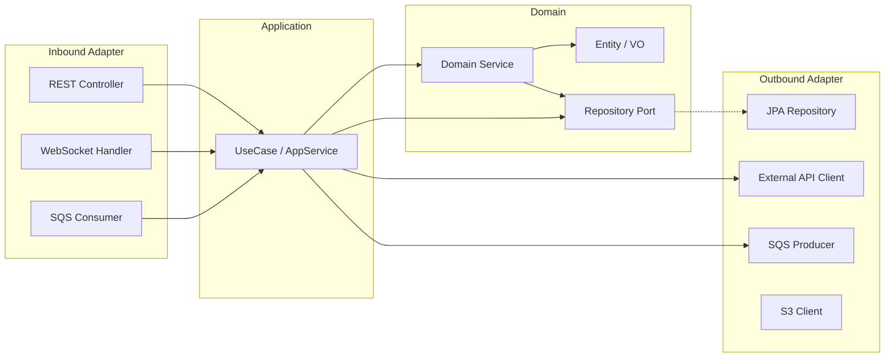

---

## 4. 모노레포 디렉토리 구조

```
bodeum/
├── backend/                          # Kotlin/Spring Cloud 모노레포 (Gradle)
│   ├── build.gradle.kts              # 루트 빌드 (공통 의존성, 버전 관리)
│   ├── settings.gradle.kts
│   │
│   ├── common/                       # 공유 모듈
│   │   ├── common-domain/            # 공통 도메인 (BaseEntity, Enum, 에러 코드)
│   │   ├── common-api/               # 공통 API (응답 래퍼, 예외 핸들러)
│   │   └── common-security/          # JWT 파서, RBAC 필터
│   │
│   ├── gateway/                      # Spring Cloud Gateway
│   │   └── src/main/kotlin/kr/bodeum/gateway/
│   │
│   ├── auth-service/                 # Auth Service
│   │   └── src/main/kotlin/kr/bodeum/auth/
│   │       ├── domain/
│   │       ├── application/
│   │       ├── api/
│   │       └── infrastructure/
│   │
│   ├── care-service/                 # Care Service
│   │   └── src/main/kotlin/kr/bodeum/care/
│   │       ├── domain/
│   │       ├── application/
│   │       ├── api/
│   │       └── infrastructure/
│   │
│   ├── ai-pipeline-service/          # AI Pipeline Service
│   │   └── src/main/kotlin/kr/bodeum/ai/
│   │       ├── domain/
│   │       ├── application/
│   │       ├── api/
│   │       └── infrastructure/
│   │
│   ├── notification-service/         # Notification Service
│   │   └── src/main/kotlin/kr/bodeum/notification/
│   │       ├── domain/
│   │       ├── application/
│   │       ├── api/
│   │       └── infrastructure/
│   │
│   ├── payment-service/              # Payment Service (2단계~)
│   │   └── src/main/kotlin/kr/bodeum/payment/
│   │
│   ├── integration-service/          # Integration Service — 공단 엑셀 연동·ERP 호환 (3단계)
│   │   └── src/main/kotlin/kr/bodeum/integration/
│   │
│   ├── billing-service/              # Billing Service — 본인부담금 (3단계)
│   │   └── src/main/kotlin/kr/bodeum/billing/
│   │
│   └── payroll-service/              # ⚡ Payroll Service — 독립 서비스 (도메인 비의존)
│       │                             # 별도 DB 스키마 (payroll). 피벗 시 타 플랫폼 재사용 가능.
│       │                             # Care/AI 서비스와 의존성 없음. AttendanceLog 이벤트만 수신.
│       └── src/main/kotlin/kr/bodeum/payroll/
│           ├── domain/
│           ├── application/
│           ├── api/
│           └── infrastructure/
│
├── app/                              # React Native (Expo Router, 역할별 분기)
│   ├── app/                          # Expo Router 파일 기반 라우팅
│   │   ├── (auth)/                   # 공통 인증 화면
│   │   │   ├── login.tsx
│   │   │   └── biometric.tsx
│   │   ├── (caregiver)/              # 요양보호사 전용 (홈/녹음/기록/내정보)
│   │   │   ├── _layout.tsx
│   │   │   ├── today.tsx
│   │   │   ├── record/
│   │   │   ├── history.tsx
│   │   │   └── profile.tsx
│   │   ├── (director)/               # 원장님 전용 (홈/승인/현황/알림/내정보)
│   │   │   ├── _layout.tsx
│   │   │   ├── home.tsx
│   │   │   ├── approve.tsx
│   │   │   ├── status.tsx
│   │   │   ├── notifications.tsx
│   │   │   └── profile.tsx
│   │   └── _layout.tsx               # 역할 기반 레이아웃 분기
│   ├── src/
│   │   ├── components/               # 공통 UI 컴포넌트
│   │   ├── hooks/                    # Custom Hooks
│   │   ├── services/                 # API 클라이언트
│   │   ├── stores/                   # 상태 관리 (Zustand)
│   │   ├── locales/                  # i18n 번역 파일 (ko, en, vi, zh-CN)
│   │   ├── i18n/                     # i18next 초기화
│   │   └── utils/                    # 유틸리티
│   ├── package.json
│   └── app.json
│
├── web/                              # React SPA (웹 백오피스 + 어드민)
│   ├── src/
│   │   ├── pages/                    # 페이지 컴포넌트
│   │   ├── components/               # 공통 UI 컴포넌트
│   │   ├── hooks/                    # Custom Hooks
│   │   ├── services/                 # API 클라이언트
│   │   ├── stores/                   # 상태 관리
│   │   ├── routes/                   # 라우팅
│   │   └── utils/                   # 유틸리티
│   ├── package.json
│   └── vite.config.ts
│
├── infra/                            # 인프라 코드
│   ├── docker/                       # Docker Compose (로컬 개발)
│   ├── terraform/                    # AWS IaC (1~2단계)
│   ├── k8s/                          # Kubernetes 매니페스트 (3단계)
│   └── scripts/                      # 배포·마이그레이션 스크립트
│
├── docs/                             # 설계 문서
│   ├── 기획/                          # PRD, 용어사전, 명세서
│   └── architecture/                 # ADR (Architecture Decision Records)
│
├── CLAUDE.md                         # Claude Code 설정
└── README.md
```

---

## 5. 기술 스택 상세

### 5.1 Backend

| 영역 | 기술 | 버전 | 선정 근거 |
|:---|:---|:---|:---|
| 언어 | Kotlin | 2.3.20 | Coroutine 기반 비동기, Null Safety, Spring 공식 지원 |
| 프레임워크 | Spring Boot | 4.0.3 | MSA 생태계, Spring Cloud 통합 |
| API Gateway | Spring Cloud Gateway | — | 라우팅, JWT 검증, Rate Limiting |
| 서비스 간 통신 | AWS SQS | — | 비동기 이벤트. Spring Cloud Stream 래핑 |
| ORM | Spring Data JPA + Kotlin JDSL | — | 타입 안전 쿼리, K2 호환, 메타모델 불필요 |
| 마이그레이션 | Flyway | — | 버전 관리 DB 스키마 |
| 빌드 | Gradle (Kotlin DSL) | 9.4.0 | 멀티 모듈, 캐싱, Convention Plugins |

### 5.2 Frontend

| 영역 | 기술 | 버전 | 선정 근거 |
|:---|:---|:---|:---|
| 모바일 | React Native | 0.83 | iOS/Android 동시 지원, Expo managed workflow |
| 웹 | React | 19.2.4 | SPA, Vite 기반 빌드 |
| 언어 | TypeScript | 5.x | 타입 안전 |
| 스타일링 | Tailwind CSS v4 + shadcn/ui (웹) / NativeWind + Gluestack UI (앱) | — | 유틸리티 퍼스트, Web/App 디자인 일관성 |
| 상태 관리 | Zustand | — | 경량, 보일러플레이트 최소 |
| API 클라이언트 | TanStack Query (React Query) | — | 서버 상태 캐싱, 자동 재시도 |
| 다국어 | react-i18next + i18next | 24.x | 앱 UI 다국어 (ko/en/vi/zh-CN), 웹은 한국어 단일 |
| 날짜 | date-fns + date-fns-tz | — | 로케일별 날짜 포매팅, 타임존 변환 |

### 5.3 인프라 (AWS)

| 영역 | 기술 | 선정 근거 |
|:---|:---|:---|
| 컴퓨팅 (1~2단계) | ECS Fargate | 서버리스 컨테이너, 운영 부담 최소 |
| 컴퓨팅 (3단계) | EKS (Kubernetes) | 서비스별 독립 스케일링, HPA |
| 데이터베이스 | RDS PostgreSQL 17 Multi-AZ | 자동 Failover, 일일 백업 |
| 캐시 | ElastiCache Redis | 세션, Rate Limiting, OTP 임시 저장 |
| 스토리지 | S3 (SSE 암호화) | 음성 파일, PDF, 리포트 저장 |
| 메시지 큐 | SQS | 서비스 간 비동기 이벤트 |
| CDN | CloudFront | 웹 SPA 정적 배포 |
| DNS | Route 53 | 도메인 관리 |
| 모니터링 | CloudWatch + Sentry | 메트릭, 로그, 에러 추적 |
| CI/CD | GitHub Actions + Docker | 자동 빌드·테스트·배포 |

---

## 6. 데이터 아키텍처

### 6.1 데이터베이스 전략

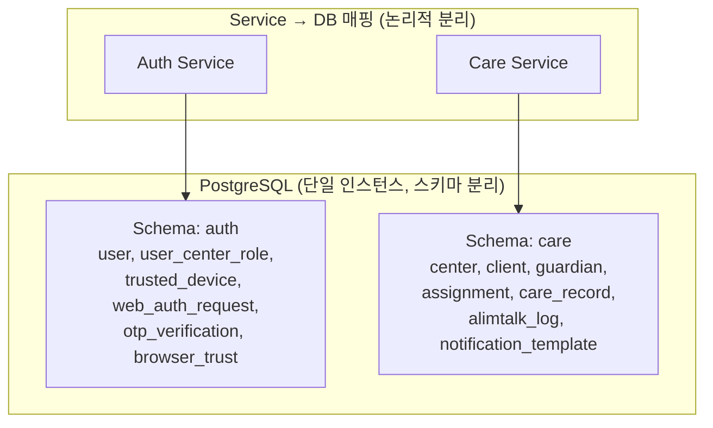

**1단계**: 단일 RDS 인스턴스 + 스키마 분리 (비용 최적화)
**2단계+**: 서비스별 독립 RDS 인스턴스 (필요 시 분리)
**3단계**: Read Replica 추가 (분석 대시보드, 트렌드 쿼리)

### 6.2 글로벌 DB 설계 원칙

| 설정 | 값 | 근거 |
|:---|:---|:---|
| Encoding | `UTF-8` | 한국어 + 베트남어 + 중국어 + 영어 모두 지원 |
| Default Collation | `C.UTF-8` | 인덱스 성능 최적, 바이너리 비교 |
| 한국어 Collation | `ko_icu` (ICU) | 한국어 정렬이 필요한 컬럼에 명시적 적용 |
| Timezone 저장 | `TIMESTAMPTZ` | UTC 저장, 클라이언트에서 KST 변환 |
| 전화번호 | E.164 포맷 | `+821012345678` (국제 번호 대응) |
| 문자열 길이 | 글로벌 권장 기준 | user.name=100, center.name=200, address=500 |

**타임존 처리 흐름**:
- **Database**: `TIMESTAMPTZ` 타입. 모든 시간 데이터 UTC 저장
- **Backend**: `Instant` (Kotlin). 시간 연산은 항상 UTC
- **API 응답**: ISO 8601 + Offset (`2026-03-18T09:00:00+09:00`)
- **Frontend**: `date-fns` + `Intl.DateTimeFormat`으로 사용자 로케일에 맞춰 표시

> 현재는 한국(KST) 단일이지만, UTC 저장 원칙을 지키면 향후 해외 확장 시 타임존 변환 코드만 추가하면 된다.

### 6.3 기관 유형별 서비스 분기

| 기관 유형 | facility_type | 기록 주기 | AI 프롬프트 컨텍스트 | 알림톡 대상 | 단계 |
|:---|:---|:---|:---|:---|:---|
| 방문요양 | HOME_VISIT | 방문당 1건 | "방문 종료 후" 문맥 | 보호자 (자택 외부) | 1단계 |
| 요양원 | NURSING_HOME | 근무 교대당 1건 | "근무 중" 문맥, 다수 수급자 | 보호자 (시설 외부) | 2단계 |
| 주야간보호 | DAY_NIGHT | 일과 종료 시 | "일과 중" 문맥 | 보호자 (자택) | 3단계 |
| 방문목욕 | HOME_BATH | 서비스당 1건 | "목욕 서비스" 특화 | 보호자 | 3단계 |
| 방문간호 | HOME_NURSE | 방문당 1건 | "간호 처치" 특화 | 보호자 | 3단계 |

> **설계 원칙**: `Center.facility_type`으로 분기. 1단계에서는 `HOME_VISIT` 기본값만 활성화. Care Service의 AI 프롬프트 템플릿과 기록 주기 로직이 facility_type에 따라 분기된다. 기관 유형 추가 시 Care Service만 수정하면 되도록 격리.

### 6.5 데이터 암호화 전략

| 대상 | 저장 시 | 전송 시 |
|:---|:---|:---|
| 수급자 이름·주소 | AES-256 (컬럼 암호화) | TLS 1.3 |
| 보호자 이름·전화번호 | AES-256 (컬럼 암호화) | TLS 1.3 |
| 음성 파일 | S3 SSE-S3 | TLS 1.3 |
| Solapi API 키 | AES-256 (컬럼 암호화) | TLS 1.3 |
| PG 빌링키 (2단계) | AES-256 (컬럼 암호화) | TLS 1.3 |
| JWT | — | TLS 1.3 |
| OTP 코드 | SHA-256 해시 | TLS 1.3 |

### 6.6 S3 버킷 구조

```
bodeum-audio/
├── {centerId}/{year}/{month}/{recordId}.m4a     # 원본 음성

bodeum-exports/
├── {centerId}/{year}/{month}/                    # PDF/Excel 내보내기
│   ├── care-records-{date}.pdf
│   └── care-records-{date}.xlsx

bodeum-reports/                                    # 2단계 프리미엄 리포트
├── {centerId}/{year}/{month}/
│   └── premium-{clientId}-{month}.pdf
```

---

## 7. 보안 아키텍처

### 7.1 계층형 인증 아키텍처

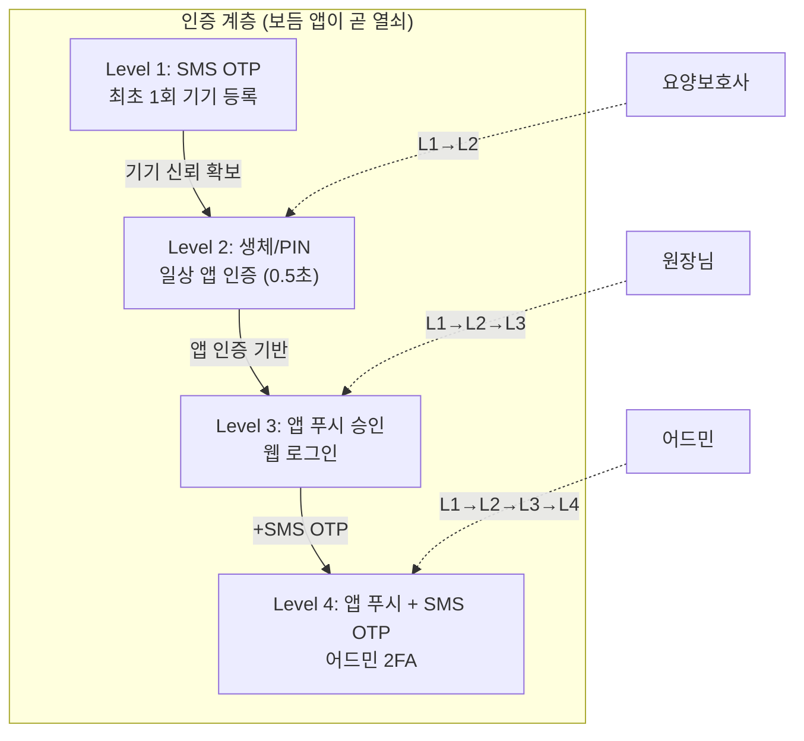

### 7.2 JWT 토큰 전략

| 토큰 | 유효기간 | 저장 위치 | 갱신 |
|:---|:---|:---|:---|
| Access Token | 15분 | 앱: 메모리 / 웹: 메모리 | Refresh Token으로 갱신 |
| Refresh Token (앱) | 90일 | Secure Storage (Keychain/Keystore) | 기기 신뢰 기간과 동일 |
| Refresh Token (웹) | 14일 | HttpOnly Secure Cookie | 브라우저 신뢰 기간과 동일 |

### 7.3 RBAC 정책

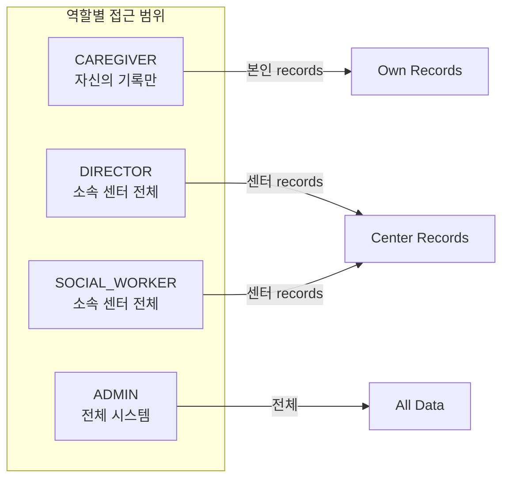

**Spring Security 필터 체인**:
1. `JwtAuthenticationFilter` — Access Token 파싱 + 검증
2. `DeviceTrustFilter` — 앱 요청 시 기기 신뢰 검증
3. `MfaVerificationFilter` — 어드민 API 접근 시 `mfa_verified` 확인
4. `CenterScopeFilter` — `active_center_id` 기반 데이터 범위 제한

---

## 8. 인프라 아키텍처

### 8.1 1단계 — ECS Fargate 구성

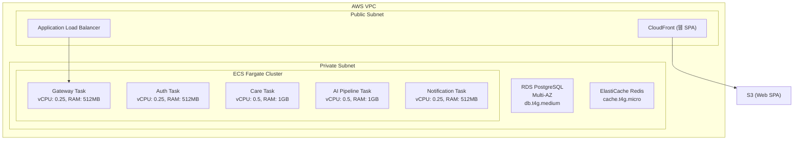

### 8.2 3단계 — EKS 구성 (확장)

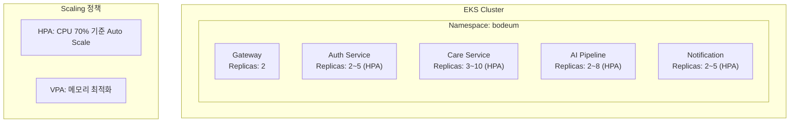

---

## 9. 비동기 이벤트 아키텍처

### 9.1 이벤트 흐름

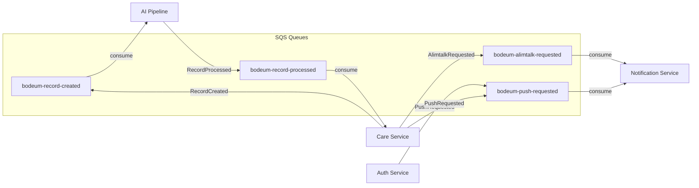

### 9.2 이벤트 정의

| 이벤트 | Producer | Consumer | 큐 | 설명 |
|:---|:---|:---|:---|:---|
| `RecordCreated` | Care | AI Pipeline | `bodeum-record-created` | 음성 업로드 완료 → AI 처리 요청 |
| `RecordProcessed` | AI Pipeline | Care | `bodeum-record-processed` | AI 초안 생성 완료 → 기록 업데이트 |
| `RecordProcessFailed` | AI Pipeline | Care | `bodeum-record-processed` | AI 처리 실패 → 재시도/알림 |
| `AlimtalkRequested` | Care, Billing, Payroll | Notification | `bodeum-alimtalk-requested` | 제출 → 알림톡 발송 (돌봄알림, 영수증, 급여명세서) |
| `PushRequested` | Auth, Care | Notification | `bodeum-push-requested` | 푸시 알림 발송 |
| `MeetingRecordCreated` | Care | AI Pipeline | `bodeum-meeting-created` | 🆕 회의 녹음 업로드 → AI 회의록 생성 요청 |
| `MeetingProcessed` | AI Pipeline | Care | `bodeum-meeting-processed` | 🆕 AI 회의록 생성 완료 |
| `CounselJournalRequested` | Care | AI Pipeline | `bodeum-counsel-requested` | 🆕 상담일지 AI 초안 생성 요청 |
| `CounselJournalProcessed` | AI Pipeline | Care | `bodeum-counsel-processed` | 🆕 상담일지 AI 초안 완료 |
| `EvaluationDraftRequested` | Care | AI Pipeline | `bodeum-eval-requested` | 🆕 기초평가 AI 초안 생성 요청 |
| `EvaluationDraftProcessed` | AI Pipeline | Care | `bodeum-eval-processed` | 🆕 기초평가 AI 초안 완료 |
| `AttendanceCompleted` | Care | **Payroll** | `bodeum-attendance-completed` | 🆕 월 근무 확정 → Payroll 급여 계산 트리거. **Payroll Service가 느슨하게 결합하는 유일한 인터페이스.** |
| `PayrollCalculated` | **Payroll** | Notification | `bodeum-payroll-calculated` | 🆕 급여 계산 완료 → 명세서 알림톡 발송 |
| `BillingCreated` | Billing | Notification | `bodeum-billing-created` | 🆕 본인부담금 청구 생성 → 영수증 알림톡 발송 |
| `ExcelImportCompleted` | Integration | Care | `bodeum-excel-imported` | 🆕 공단 엑셀 임포트 완료 → 일정/청구 데이터 반영 |

### 9.3 실패 처리 전략

| 시나리오 | 전략 |
|:---|:---|
| AI Pipeline 처리 실패 | 3회 재시도 (exponential backoff). DLQ(Dead Letter Queue)로 이동 후 어드민 알림 |
| 알림톡 발송 실패 | 3회 재시도. 실패 시 `alimtalk_status = FAILED`로 기록, 어드민 대시보드 표시 |
| SQS 메시지 유실 | SQS 가시성 타임아웃 + DLQ. CloudWatch 알람 |

---

## 10. 성능 및 확장성

### 10.1 성능 목표

| 항목 | 1단계 | 2단계 | 3단계 |
|:---|:---|:---|:---|
| 음성 → AI 초안 | 15초 이내 | 12초 이내 | 10초 이내 |
| 알림톡 발송 지연 | 30초 이내 | 15초 이내 | 10초 이내 |
| 웹 페이지 로드 | 2초 이내 | 1.5초 이내 | 1초 이내 |
| 동시 접속 | 50명 | 1,000명 | 10,000명 |
| 가용성 | 99.5% | 99.9% | 99.9% |

### 10.2 캐싱 전략

| 대상 | 저장소 | TTL | 무효화 |
|:---|:---|:---|:---|
| JWT 블랙리스트 | Redis | Access Token 만료까지 | 로그아웃 시 |
| OTP 검증 데이터 | Redis | 3분 | 검증 완료 시 |
| 활성 센터 정보 | Redis | 5분 | 센터 정보 수정 시 |
| Rate Limiting 카운터 | Redis | 1분/1시간 (정책별) | 자동 만료 |
| 오늘 방문 목록 | Redis | 30분 | 배정 변경 시 |

### 10.3 확장 전략

```
1단계 (50명)    → ECS Fargate 고정 Task 수
2단계 (1,000명) → ECS Auto Scaling (CPU 기반)
3단계 (10,000명) → EKS + HPA + 서비스별 독립 DB
```

---

## 11. CI/CD 파이프라인

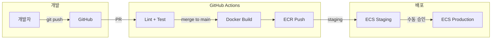

| 단계 | 트리거 | 작업 |
|:---|:---|:---|
| PR Check | Pull Request | ktlint, detekt, 단위 테스트, 빌드 |
| Staging 배포 | main 머지 | Docker 빌드 → ECR Push → ECS Staging 배포 |
| Production 배포 | 수동 승인 | ECS Blue-Green 배포 |
| DB 마이그레이션 | Flyway (서비스 시작 시) | 스키마 변경 자동 적용 |

---

## 12. 모니터링 및 관찰성

### 12.1 모니터링 스택

| 영역 | 도구 | 용도 |
|:---|:---|:---|
| 메트릭 | CloudWatch | CPU, 메모리, 네트워크, 커스텀 메트릭 |
| 로그 | CloudWatch Logs | 구조화 로그 (JSON), 서비스별 로그 그룹 |
| 에러 추적 | Sentry | 예외 추적, 성능 트랜잭션 |
| 헬스 체크 | Spring Actuator | `/actuator/health`, `/actuator/metrics` |

### 12.2 핵심 알람

| 알람 | 조건 | 채널 |
|:---|:---|:---|
| 파이프라인 성공률 저하 | < 90% (5분 윈도우) | Slack + FCM (어드민) |
| 알림톡 발송 실패 급증 | 실패율 > 10% | Slack |
| API 응답 시간 초과 | P95 > 5초 | CloudWatch |
| RDS CPU 과부하 | > 80% (10분 지속) | Slack |
| DLQ 메시지 적체 | > 0 | Slack + FCM (어드민) |
| ECS Task 비정상 종료 | 재시작 횟수 > 3/시간 | Slack |

---

## 13. 단계별 아키텍처 진화

### 13.1 1단계 → 2단계 변경점

| 영역 | 변경 |
|:---|:---|
| 서비스 추가 | Payment Service (결제, 구독) |
| Care Service 확장 | 지오펜싱, 분석 대시보드, 프리미엄 리포트, 상담일지 AI 생성, 일정 캘린더, 기초평가 관리, 근무일지·출근부 연계 기능 추가 |
| AI Pipeline 확장 | 정합성 검증 엔진, 다국어 STT 파이프라인, 상담일지 AI 초안 생성, 기초평가 AI 초안, 사례회의록·직원회의록 AI 작성 (회의 녹음 STT → 회의록) |
| 인프라 | ECS Auto Scaling 적용, Read Replica 추가 (분석용) |
| 모니터링 | Grafana 대시보드 추가, 비즈니스 메트릭 수집 |

### 13.2 2단계 → 3단계 변경점

| 영역 | 변경 |
|:---|:---|
| 인프라 전환 | ECS Fargate → EKS (Kubernetes) |
| DB 분리 | 서비스별 독립 RDS 인스턴스 |
| 서비스 추가 | Integration Service (공단 엑셀 연동·ERP 호환), Billing Service (본인부담금) |
| **독립 서비스 (도메인 비의존)** | **Payroll Service** — 범용 급여 모듈. 시급/월급 계산, 수당·공제, 4대보험, 급여대장, 명세서 발송. 장기요양 도메인과 무관하므로 별도 DB 스키마·별도 Git 모듈로 독립 설계·배포. 피벗 시 타 플랫폼 재사용 가능. Care/AI 서비스와 의존성 없음. AttendanceLog(근무일지)만 입력으로 참조. |
| AI 확장 | 건강 트렌드 분석 모델, 이상 징후 감지, AI 업무 가이드 (오늘의 할 일 자동 추천) |
| 데이터 파이프라인 | 장기 데이터 분석을 위한 Data Lake(S3 + Athena) |

---

## 부록 A: ADR (Architecture Decision Records)

### ADR-001: 모노레포 선택

**상태**: 승인
**결정**: backend, app, web, infra를 단일 Git 저장소에서 관리
**근거**: 초기 팀(1~2명) 환경에서 의존성 관리 단순화, 코드 리뷰 효율화

### ADR-002: ECS Fargate 우선 (1단계)

**상태**: 승인
**결정**: 1~2단계는 ECS Fargate, 3단계에서 EKS 전환
**근거**: 운영 부담 최소화. 100개소 이하에서는 Fargate로 충분. k8s 운영 비용은 1,000개소 이상에서 정당화.

### ADR-003: 단일 RDS + 스키마 분리 (1단계)

**상태**: 승인
**결정**: auth, care 스키마를 단일 PostgreSQL 인스턴스에 배치
**근거**: 초기 비용 절감. 서비스별 DB 분리는 2~3단계에서 트래픽에 따라 결정.

### ADR-004: SQS 기반 비동기 통신

**상태**: 승인
**결정**: Kafka 대신 AWS SQS 채택
**근거**: 관리형 서비스로 운영 부담 최소. 현재 처리량(수백 TPS)에서 충분. 3단계에서 Kafka 검토.

### ADR-005: 계층형 인증 (보듬 앱이 곧 열쇠)

**상태**: 승인
**결정**: 카카오/이메일 로그인 배제, 모바일 앱 중심 인증
**근거**: SMS 비용 구조적 절감 (35만→1만/월), 단일 인프라 관리, 고령 사용자 생체 인증 편의성.

### ADR-006: Payroll Service 독립 서비스 설계 🆕

**상태**: 승인
**결정**: 직원 급여(F-ERP-003)는 장기요양 도메인과 무관한 범용 급여 모듈이므로, 별도 DB 스키마(payroll)·별도 Git 모듈로 독립 설계·독립 배포한다. Care Service, AI Pipeline 등 핵심 서비스와 코드 의존성을 두지 않으며, 유일한 입력 인터페이스는 `AttendanceCompleted` 이벤트(SQS) 수신이다.
**근거**:
- 시급/월급 계산, 수당·공제, 4대보험, 급여대장은 업종 불문 동일 로직
- 패밀리케어 ERP 분석 결과, 직원 급여 기능에 장기요양 특화 로직 없음 확인
- 향후 피벗 시 Payroll Service를 타 플랫폼에 그대로 이식 가능
- 개발 우선순위를 3단계 이후로 유연하게 조절 가능 (핵심 VP와 독립)
**트레이드오프**: 모노레포 내 별도 모듈이므로 빌드·배포 파이프라인은 공유하되, 런타임은 완전 독립. 알림톡 발송은 Notification Service 인터페이스를 추상화하여 결합.

### ADR-007: 공단 연동은 엑셀 기반 (API 미제공) 🆕

**상태**: 승인
**결정**: 공단(국민건강보험공단)은 운영 데이터(일정계획, 청구내역, 급여제공기록 RFID) API를 제공하지 않으므로, Integration Service는 엑셀 파일 임포트/익스포트 방식으로 설계한다.
**근거**:
- data.go.kr 장기요양 API는 기관 검색·시설 현황 등 공공정보 조회용만 존재
- 롱텀케어, 케어포, 패밀리케어 등 모든 주요 ERP가 공단 엑셀 다운로드/업로드 방식으로 연동
- RFID 급여제공기록은 공단 앱(스마트 장기요양)에서 NFC로 처리, 외부 API 없음
**트레이드오프**: 실시간 연동 불가. 엑셀 양식 변경 시 파싱 로직 유지보수 필요. 장기적으로 파일 감시·일괄 처리 자동화로 UX 개선.

---

## 부록 B: 참고 문서

- 보듬_PRD_v0.1.0.md
- 보듬_엔티티_명세서_v0.0.1.md
- 보듬_API_명세서_v0.0.1.md
- 보듬_도메인_용어사전_v0.0.1.md
- 보듬_설계보강_v0.0.1.md
- 보듬_브랜드_가이드라인_v0.0.1.md
- 보듬_기술스택_v0.0.1.md
- 보듬_코드컨벤션_v0.0.1.md
