# 보듬(Bodeum) 엔티티 명세서

> **문서 버전**: 0.0.1
> **작성일**: 2026-03-18
> **기반 문서**: 보듬_PRD_v0.1.0.md, 보듬_도메인_용어사전_v0.0.1.md
> **대상 범위**: 전체 시스템 (1단계 핵심 ~ 3단계 확장)
> **네이밍 규칙**: Kotlin PascalCase / DB snake_case / API kebab-case
> **PK 전략**: UUID v7 (RFC 9562) — 시간순 정렬 보장, B-tree 인덱스 최적화. `uuid_generate_v7()` 함수 사용.

---

## 1. ERD 다이어그램

```mermaid
erDiagram
    Center ||--o{ UserCenterRole : "소속"
    Center ||--o{ Client : "등록"
    Center ||--o{ CareRecord : "귀속"
    Center ||--o{ Subscription : "2단계-구독"
    Center ||--o{ ExcelIntegration : "3단계-엑셀연동"
    Center ||--o{ CounselJournal : "3단계-상담일지"
    Center ||--o{ Schedule : "3단계-일정"
    Center ||--o{ HealthEvaluation : "3단계-평가"
    Center ||--o{ MeetingMinutes : "3단계-회의록"
    Center ||--o{ AttendanceLog : "3단계-근무일지"
    Center ||--o{ SelfPaymentBilling : "3단계-본인부담금"
    Center ||--o{ Payroll : "3단계-급여"

    User ||--o{ UserCenterRole : "역할 보유"
    User ||--o{ TrustedDevice : "기기 등록"
    User ||--o{ WebAuthRequest : "웹 인증"
    User ||--o{ CounselJournal : "상담"
    User ||--o{ HealthEvaluation : "평가"
    User ||--o{ MeetingMinutes : "회의록"
    User ||--o{ AttendanceLog : "근무일지"
    User ||--o{ Payroll : "급여"

    UserCenterRole ||--o{ Assignment : "배정"

    Client ||--o{ Guardian : "보호자"
    Client ||--o{ Assignment : "담당"
    Client ||--o{ CareRecord : "기록 대상"
    Client ||--o{ Geofence : "2단계-지오펜스"
    Client ||--o{ HealthTrend : "3단계-트렌드"
    Client ||--o{ CounselJournal : "3단계-상담"
    Client ||--o{ Schedule : "3단계-일정"
    Client ||--o{ HealthEvaluation : "3단계-평가"
    Client ||--o{ SelfPaymentBilling : "3단계-청구"
    Client ||--o{ AttendanceLog : "3단계-방문"

    CareRecord ||--o| ConsistencyCheck : "2단계-정합성"
    CareRecord ||--o| AlimtalkLog : "발송 로그"
    CareRecord ||--o{ AttendanceLog : "3단계-근무"

    User ||--o{ CareRecord : "작성(caregiver)"
    User ||--o{ CareRecord : "확정(confirmer)"

    ExcelIntegration ||--o{ ExcelSyncLog : "3단계-동기화"
```



---

## 2. 1단계 핵심 엔티티

### 2.1 Center (센터)

장기요양기관(재가 또는 시설). 모든 비즈니스 데이터의 테넌트 루트.

| 컬럼 | 타입 | 제약조건 | 설명 |
|:---|:---|:---|:---|
| `id` | `UUID` | PK | 센터 고유 ID |
| `name` | `VARCHAR(200)` | NOT NULL | 기관명 (다국어 표기 대응) |
| `business_number` | `VARCHAR(12)` | UNIQUE, NOT NULL | 사업자등록번호 |
| `address` | `VARCHAR(500)` | NOT NULL | 기관 주소 |
| `phone` | `VARCHAR(20)` | NOT NULL | 대표 전화번호 |
| `facility_type` | `VARCHAR(20)` | NOT NULL, DEFAULT `'HOME_VISIT'` | 기관 유형. `HOME_VISIT`(방문요양), `NURSING_HOME`(요양원), `DAY_NIGHT`, `HOME_BATH`, `HOME_NURSE` |
| `kakao_channel_id` | `VARCHAR(100)` | NULLABLE | 카카오 비즈니스 채널 ID |
| `solapi_api_key` | `TEXT` | NULLABLE, ENCRYPTED | 솔라피 API 키 (AES-256) |
| `solapi_api_secret` | `TEXT` | NULLABLE, ENCRYPTED | 솔라피 API 시크릿 (AES-256) |
| `status` | `ENUM` | NOT NULL, DEFAULT `ACTIVE` | `PENDING_APPROVAL`, `ACTIVE`, `SUSPENDED` |
| `created_at` | `TIMESTAMPTZ` | NOT NULL | 생성일시 (UTC) |
| `updated_at` | `TIMESTAMPTZ` | NOT NULL | 수정일시 (UTC) |

**인덱스**:
- `idx_center_status` — 상태별 조회
- `idx_center_business_number` — 사업자등록번호 중복 방지
- `idx_center_facility_type` — 기관 유형별 조회

> **글로벌 설계**: `TIMESTAMPTZ`로 UTC 저장. `name` 200자로 확장(다국어 기관명). `facility_type` 1단계에서는 `HOME_VISIT` 기본값, 2단계에서 `NURSING_HOME` 활성화.

---

### 2.2 User (통합 사용자)

전체 역할 공통의 인증 주체. 역할과 센터 소속은 `UserCenterRole`로 분리.

| 컬럼 | 타입 | 제약조건 | 설명 |
|:---|:---|:---|:---|
| `id` | `UUID` | PK | 사용자 고유 ID |
| `phone` | `VARCHAR(20)` | UNIQUE, NOT NULL | 전화번호, E.164 국제 포맷 (예: `+821012345678`) |
| `name` | `VARCHAR(100)` | NOT NULL | 이름 (외국인 이름 길이 대응) |
| `preferred_locale` | `VARCHAR(10)` | NOT NULL, DEFAULT `'ko'` | 앱 UI 언어 설정. `ko`, `en`, `vi`, `zh-CN` |
| `status` | `ENUM` | NOT NULL, DEFAULT `INVITED` | `ACTIVE`, `INVITED`, `INACTIVE` |
| `last_login_at` | `TIMESTAMPTZ` | NULLABLE | 마지막 로그인 일시 (UTC) |
| `created_at` | `TIMESTAMPTZ` | NOT NULL | 생성일시 (UTC) |
| `updated_at` | `TIMESTAMPTZ` | NOT NULL | 수정일시 (UTC) |

**제약조건**:
- `CHECK (phone ~ '^\+[1-9]\d{6,14}$')` — E.164 국제 전화번호 형식 검증

**인덱스**:
- `uidx_user_phone` — 전화번호 유니크 (로그인 키)

**설계 원칙**:
- User는 인증 주체이며, 역할·센터 소속은 `UserCenterRole`로 분리
- 한 사용자가 여러 센터에 서로 다른 역할로 소속 가능 (예: A센터 요양보호사 + B센터 요양보호사)
- DB에 별도 Caregiver, Director 테이블은 없음
- 전화번호는 E.164 국제 포맷으로 저장 (한국: `+82`, 향후 베트남: `+84` 등)
- `preferred_locale`로 앱 UI 다국어 지원 (1단계: `ko` 기본, 2단계: `en`/`vi` 추가)
- 모든 시간 컬럼은 `TIMESTAMPTZ` (UTC 저장, 클라이언트에서 KST 변환)

---

### 2.3 UserCenterRole (사용자-센터 역할)

User와 Center의 N:M 매핑 + 역할. 다중 센터·다중 역할 모델의 핵심.

| 컬럼 | 타입 | 제약조건 | 설명 |
|:---|:---|:---|:---|
| `id` | `UUID` | PK | 매핑 고유 ID |
| `user_id` | `UUID` | FK → `user.id`, NOT NULL | 사용자 |
| `center_id` | `UUID` | FK → `center.id`, NULLABLE | 센터 (ADMIN은 NULL) |
| `role` | `ENUM` | NOT NULL | `CAREGIVER`, `DIRECTOR`, `SOCIAL_WORKER`, `ADMIN` |
| `status` | `ENUM` | NOT NULL, DEFAULT `ACTIVE` | `ACTIVE`, `INACTIVE` |
| `created_at` | `TIMESTAMPTZ` | NOT NULL | 생성일시 |
| `updated_at` | `TIMESTAMPTZ` | NOT NULL | 수정일시 |

**제약조건**:
- `UNIQUE(user_id, center_id, role)` — 동일 센터에 동일 역할 중복 방지
- `ADMIN`은 `center_id = NULL` (센터에 종속되지 않는 글로벌 역할)

**인덱스**:
- `idx_ucr_user_id` — 사용자별 역할 목록
- `idx_ucr_center_id_role` — 센터별 역할별 사용자 목록
- `uidx_ucr_user_center_role` — 유니크 제약

---

### 2.4 TrustedDevice (신뢰 기기)

SMS OTP로 검증 완료 후 등록된 모바일 디바이스. 기기 신뢰 인증의 기반.

| 컬럼 | 타입 | 제약조건 | 설명 |
|:---|:---|:---|:---|
| `id` | `UUID` | PK | 기기 고유 ID |
| `user_id` | `UUID` | FK → `user.id`, NOT NULL | 소유 사용자 |
| `device_id` | `VARCHAR(255)` | NOT NULL | 디바이스 고유 식별자 |
| `device_name` | `VARCHAR(100)` | NOT NULL | 표시명 (예: "iPhone 14") |
| `device_fingerprint` | `VARCHAR(500)` | NOT NULL | 기기 지문 해시 |
| `platform` | `ENUM` | NOT NULL | `IOS`, `ANDROID` |
| `fcm_token` | `TEXT` | NULLABLE | Firebase Cloud Messaging 토큰 |
| `auth_method` | `ENUM` | NOT NULL | `BIOMETRIC`, `PIN` |
| `last_used_at` | `TIMESTAMPTZ` | NOT NULL | 마지막 사용 일시 |
| `expires_at` | `TIMESTAMPTZ` | NOT NULL | 만료 일시 (등록 후 90일) |
| `created_at` | `TIMESTAMPTZ` | NOT NULL | 생성일시 |
| `updated_at` | `TIMESTAMPTZ` | NOT NULL | 수정일시 |

**비즈니스 규칙**:
- 사용자당 최대 3대 등록 가능. 초과 시 가장 오래된 기기 자동 해제
- 90일 미사용 시 자동 만료 → 재등록(SMS OTP) 필요
- 기기 분실 시 앱 설정 또는 어드민에서 원격 해제

**인덱스**:
- `idx_td_user_id` — 사용자별 기기 목록
- `uidx_td_user_device` — `UNIQUE(user_id, device_id)`

---

### 2.5 WebAuthRequest (웹 인증 요청)

웹 로그인 시 생성되는 앱 푸시 승인 요청.

| 컬럼 | 타입 | 제약조건 | 설명 |
|:---|:---|:---|:---|
| `id` | `UUID` | PK (= requestId) | 요청 고유 ID |
| `user_id` | `UUID` | FK → `user.id`, NOT NULL | 인증 대상 사용자 |
| `status` | `ENUM` | NOT NULL, DEFAULT `PENDING` | `PENDING`, `APPROVED`, `REJECTED`, `EXPIRED` |
| `client_ip` | `VARCHAR(45)` | NOT NULL | 웹 클라이언트 IP |
| `user_agent` | `TEXT` | NOT NULL | 브라우저 User-Agent |
| `requested_at` | `TIMESTAMPTZ` | NOT NULL | 요청 생성 일시 |
| `expires_at` | `TIMESTAMPTZ` | NOT NULL | 만료 일시 (requested_at + 60초) |
| `approved_at` | `TIMESTAMPTZ` | NULLABLE | 승인 일시 |
| `approved_device_id` | `UUID` | FK → `trusted_device.id`, NULLABLE | 승인한 기기 |

**비즈니스 규칙**:
- 60초 TTL — 만료 시 자동으로 `EXPIRED` 전이
- WebSocket 또는 폴링으로 웹 클라이언트에 승인 상태 실시간 전달
- 하나의 User에 대해 동시에 PENDING 상태인 요청은 1개만 허용

**인덱스**:
- `idx_war_user_status` — 사용자별 대기 중 요청 조회
- `idx_war_expires_at` — 만료 요청 정리 배치

---

### 2.6 Client (수급자)

장기요양서비스를 이용하는 대상자.

| 컬럼 | 타입 | 제약조건 | 설명 |
|:---|:---|:---|:---|
| `id` | `UUID` | PK | 수급자 고유 ID |
| `center_id` | `UUID` | FK → `center.id`, NOT NULL | 소속 센터 |
| `name` | `VARCHAR(100)` | NOT NULL, ENCRYPTED | 이름 (AES-256). 다국어 이름 대응 100자 |
| `birth_date` | `DATE` | NOT NULL | 생년월일 |
| `gender` | `ENUM` | NOT NULL | `M`, `F` |
| `care_grade` | `VARCHAR(10)` | NOT NULL | 장기요양등급 (1~5, 인지지원) |
| `address` | `VARCHAR(500)` | NULLABLE, ENCRYPTED | 자택 주소 (AES-256) |
| `medical_notes` | `TEXT` | NULLABLE | 주요 질환·특이사항 (AI 프롬프트 컨텍스트) |
| `status` | `ENUM` | NOT NULL, DEFAULT `ACTIVE` | `ACTIVE`, `INACTIVE` |
| `created_at` | `TIMESTAMPTZ` | NOT NULL | 생성일시 |
| `updated_at` | `TIMESTAMPTZ` | NOT NULL | 수정일시 |

**인덱스**:
- `idx_client_center_id` — 센터별 수급자 목록
- `idx_client_center_status` — 센터별 활성 수급자

---

### 2.7 Guardian (보호자)

수급자의 가족 또는 법정 대리인. 알림톡 수신 대상.

| 컬럼 | 타입 | 제약조건 | 설명 |
|:---|:---|:---|:---|
| `id` | `UUID` | PK | 보호자 고유 ID |
| `client_id` | `UUID` | FK → `client.id`, NOT NULL | 수급자 |
| `name` | `VARCHAR(100)` | NOT NULL, ENCRYPTED | 이름 (AES-256). 다국어 이름 대응 100자 |
| `phone` | `VARCHAR(20)` | NOT NULL, ENCRYPTED | 알림톡 수신 번호 (AES-256). E.164 국제 포맷 (예: `+821012345678`) |
| `relationship_to_client` | `VARCHAR(20)` | NOT NULL | 수급자와의 관계 (아들, 딸, 며느리 등) |
| `is_primary` | `BOOLEAN` | NOT NULL, DEFAULT `true` | 주 보호자 여부 |
| `is_alimtalk_consented` | `BOOLEAN` | NOT NULL, DEFAULT `false` | 알림톡 수신 동의 여부 |
| `alimtalk_consented_at` | `TIMESTAMPTZ` | NULLABLE | 알림톡 수신 동의 일시 (개인정보보호법 동의 이력) |
| `created_at` | `TIMESTAMPTZ` | NOT NULL | 생성일시 (UTC) |
| `updated_at` | `TIMESTAMPTZ` | NOT NULL | 수정일시 (UTC) |

**제약조건**:
- 암호화된 `phone` 필드는 복호화 후 E.164 형식 검증 (`+` 시작, 7~15자리 숫자)

**인덱스**:
- `idx_guardian_client_id` — 수급자별 보호자 목록

---

### 2.8 Assignment (배정)

수급자와 담당 요양보호사의 연결 관계.

| 컬럼 | 타입 | 제약조건 | 설명 |
|:---|:---|:---|:---|
| `id` | `UUID` | PK | 배정 고유 ID |
| `assigned_caregiver_role_id` | `UUID` | FK → `user_center_role.id`, NOT NULL | 배정된 요양보호사의 센터 역할 (role=CAREGIVER) |
| `client_id` | `UUID` | FK → `client.id`, NOT NULL | 수급자 |
| `visit_days` | `VARCHAR(20)` | NULLABLE | 방문 요일 (예: "MON,WED,FRI") |
| `visit_time` | `TIME` | NULLABLE | 방문 시간 |
| `start_date` | `DATE` | NOT NULL | 배정 시작일 |
| `end_date` | `DATE` | NULLABLE | 배정 종료일 |
| `status` | `ENUM` | NOT NULL, DEFAULT `ACTIVE` | `ACTIVE`, `ENDED` |
| `created_at` | `TIMESTAMPTZ` | NOT NULL | 생성일시 |
| `updated_at` | `TIMESTAMPTZ` | NOT NULL | 수정일시 |

**인덱스**:
- `idx_assign_caregiver_role` — 요양보호사별 배정 목록
- `idx_assign_client_id` — 수급자별 배정 이력
- `idx_assign_status_visit` — 활성 배정의 방문일 기준 조회

---

### 2.9 CareRecord (돌봄 기록)

하나의 방문에 대한 전체 기록 라이프사이클을 담는 핵심 엔티티.

| 컬럼 | 타입 | 제약조건 | 설명 |
|:---|:---|:---|:---|
| `id` | `UUID` | PK | 기록 고유 ID |
| `center_id` | `UUID` | FK → `center.id`, NOT NULL | 귀속 센터 |
| `caregiver_id` | `UUID` | FK → `user.id`, NOT NULL | 작성 요양보호사 |
| `client_id` | `UUID` | FK → `client.id`, NOT NULL | 대상 수급자 |
| `visit_date` | `DATE` | NOT NULL | 방문 일자 |
| `audio_file_url` | `VARCHAR(1000)` | NOT NULL | S3 음성 파일 URL |
| `audio_duration_seconds` | `INT` | NOT NULL | 음성 길이 (초) |
| `transcribed_text` | `TEXT` | NULLABLE | Whisper STT 음성→텍스트 변환 원문 |
| `ai_generated_draft` | `JSONB` | NULLABLE | AI 생성 상태변화기록지 초안 |
| `confirmed_record` | `JSONB` | NULLABLE | 원장님/사회복지사가 확정한 최종 기록 |
| `alimtalk_message` | `TEXT` | NULLABLE | 보호자 알림톡 메시지 |
| `alimtalk_status` | `ENUM` | NOT NULL, DEFAULT `PENDING` | `PENDING`, `SENT`, `FAILED` |
| `alimtalk_sent_at` | `TIMESTAMPTZ` | NULLABLE | 알림톡 발송 일시 |
| `status` | `ENUM` | NOT NULL, DEFAULT `PROCESSING` | 상태 머신 (아래 참조) |
| `revision_count` | `INT` | NOT NULL, DEFAULT `0` | 보정 횟수 (최대 3회) |
| `submitted_at` | `TIMESTAMPTZ` | NULLABLE | 제출 일시 |
| `confirmed_at` | `TIMESTAMPTZ` | NULLABLE | 확정 일시 |
| `confirmer_id` | `UUID` | FK → `user.id`, NULLABLE | 확정한 원장님/사회복지사 |
| `rejected_at` | `TIMESTAMPTZ` | NULLABLE | 반려 일시 |
| `rejected_reason` | `TEXT` | NULLABLE | 반려 사유 |
| `created_at` | `TIMESTAMPTZ` | NOT NULL | 생성일시 |
| `updated_at` | `TIMESTAMPTZ` | NOT NULL | 수정일시 |

**ai_generated_draft JSONB 구조**:
```json
{
  "physical_care_note": "신체 상태 기록",
  "cognitive_care_note": "인지 상태 기록",
  "emotional_care_note": "정서 상태 기록",
  "special_notes": "특이사항"
}
```

**상태 머신**:
```
PROCESSING → DRAFT → SUBMITTED → CONFIRMED
                ↑         ↓            ↓
                └── (보정) ┘      REJECTED → SUBMITTED
```

| 전이 | 조건 | 부수 효과 |
|:---|:---|:---|
| `PROCESSING → DRAFT` | AI 파이프라인 완료 | FCM 푸시 "기록이 준비되었습니다" |
| `DRAFT → DRAFT` | 보정 (revision_count < 3) | revision_count += 1 |
| `DRAFT → SUBMITTED` | 요양보호사 제출 | 알림톡 자동 발송 트리거, submitted_at 기록 |
| `SUBMITTED → CONFIRMED` | 원장님/사회복지사 확정 | confirmed_at, confirmer_id 기록, confirmed_record 저장 |
| `SUBMITTED → REJECTED` | 원장님/사회복지사 반려 | rejected_at, rejected_reason 기록 |
| `CONFIRMED → REJECTED` | 확정 취소 | 재검토 필요 |
| `REJECTED → SUBMITTED` | 재제출 | 알림톡 재발송 트리거 |

**인덱스**:
- `idx_cr_center_visit_date` — 센터별 날짜별 기록 목록
- `idx_cr_caregiver_visit_date` — 요양보호사별 날짜별 기록
- `idx_cr_center_status` — 센터별 상태별 기록 (pending 목록 조회)
- `idx_cr_client_visit_date` — 수급자별 기록 이력

---

### 2.10 AlimtalkLog (알림톡 발송 로그)

알림톡 발송 이력 추적을 위한 로그 엔티티.

| 컬럼 | 타입 | 제약조건 | 설명 |
|:---|:---|:---|:---|
| `id` | `UUID` | PK | 로그 고유 ID |
| `care_record_id` | `UUID` | FK → `care_record.id`, NOT NULL | 연관 돌봄 기록 |
| `guardian_id` | `UUID` | FK → `guardian.id`, NOT NULL | 수신 보호자 |
| `message` | `TEXT` | NOT NULL | 발송 메시지 내용 |
| `solapi_message_id` | `VARCHAR(100)` | NULLABLE | 솔라피 메시지 ID |
| `status` | `ENUM` | NOT NULL | `PENDING`, `SENT`, `DELIVERED`, `FAILED` |
| `error_message` | `TEXT` | NULLABLE | 실패 시 오류 메시지 |
| `sent_at` | `TIMESTAMPTZ` | NULLABLE | 발송 일시 |
| `delivered_at` | `TIMESTAMPTZ` | NULLABLE | 수신 확인 일시 |
| `created_at` | `TIMESTAMPTZ` | NOT NULL | 생성일시 |

**인덱스**:
- `idx_al_care_record_id` — 기록별 발송 이력
- `idx_al_status` — 실패 건 재처리

---

### 2.11 OtpVerification (OTP 검증 기록)

SMS OTP 발송 및 검증 이력.

| 컬럼 | 타입 | 제약조건 | 설명 |
|:---|:---|:---|:---|
| `id` | `UUID` | PK | 검증 고유 ID |
| `phone` | `VARCHAR(20)` | NOT NULL | 수신 전화번호 |
| `code` | `VARCHAR(6)` | NOT NULL | OTP 코드 (해시 저장) |
| `purpose` | `ENUM` | NOT NULL | `DEVICE_REGISTER`, `WEB_LOGIN_FALLBACK`, `ADMIN_2FA` |
| `status` | `ENUM` | NOT NULL, DEFAULT `PENDING` | `PENDING`, `VERIFIED`, `EXPIRED`, `FAILED` |
| `attempt_count` | `INT` | NOT NULL, DEFAULT `0` | 시도 횟수 (최대 5회) |
| `expires_at` | `TIMESTAMPTZ` | NOT NULL | 만료 일시 (발송 후 3분) |
| `verified_at` | `TIMESTAMPTZ` | NULLABLE | 검증 완료 일시 |
| `created_at` | `TIMESTAMPTZ` | NOT NULL | 생성일시 |

**비즈니스 규칙**:
- 3분 TTL, 최대 5회 시도 후 만료
- 동일 전화번호에 대해 1분 내 재발송 불가 (Rate Limiting)

**인덱스**:
- `idx_otp_phone_status` — 전화번호별 활성 OTP 조회

---

### 2.12 BrowserTrust (브라우저 신뢰)

웹 로그인 완료 후 브라우저를 신뢰하여 14일간 간편 재인증을 허용하는 기록.

| 컬럼 | 타입 | 제약조건 | 설명 |
|:---|:---|:---|:---|
| `id` | `UUID` | PK | 신뢰 고유 ID |
| `user_id` | `UUID` | FK → `user.id`, NOT NULL | 사용자 |
| `browser_fingerprint` | `VARCHAR(500)` | NOT NULL | 브라우저 지문 해시 |
| `user_agent` | `TEXT` | NOT NULL | User-Agent |
| `ip_address` | `VARCHAR(45)` | NOT NULL | 최초 인증 IP |
| `last_used_at` | `TIMESTAMPTZ` | NOT NULL | 마지막 사용 일시 |
| `expires_at` | `TIMESTAMPTZ` | NOT NULL | 만료 일시 (14일) |
| `created_at` | `TIMESTAMPTZ` | NOT NULL | 생성일시 |

**인덱스**:
- `idx_bt_user_fingerprint` — 사용자별 브라우저 조회

---

## 3. 2단계 엔티티 (성장)

### 3.1 Subscription (구독)

센터별 구독 과금 정보. F-PAY-001.

| 컬럼 | 타입 | 제약조건 | 설명 |
|:---|:---|:---|:---|
| `id` | `UUID` | PK | 구독 고유 ID |
| `center_id` | `UUID` | FK → `center.id`, UNIQUE, NOT NULL | 센터 (1:1) |
| `subscription_plan` | `ENUM` | NOT NULL | `TRIAL`, `BASIC`, `PREMIUM` |
| `status` | `ENUM` | NOT NULL, DEFAULT `ACTIVE` | `ACTIVE`, `PAST_DUE`, `CANCELLED`, `SUSPENDED` |
| `billing_key` | `TEXT` | NULLABLE, ENCRYPTED | PG 빌링키 (AES-256) |
| `pg_provider` | `ENUM` | NOT NULL | `TOSS_PAYMENTS`, `IAMPORT` |
| `current_period_start` | `DATE` | NOT NULL | 현재 구독 기간 시작 |
| `current_period_end` | `DATE` | NOT NULL | 현재 구독 기간 종료 |
| `trial_ends_at` | `DATE` | NULLABLE | 시범 운영 종료일 |
| `cancelled_at` | `TIMESTAMPTZ` | NULLABLE | 해지 일시 |
| `created_at` | `TIMESTAMPTZ` | NOT NULL | 생성일시 |
| `updated_at` | `TIMESTAMPTZ` | NOT NULL | 수정일시 |

**비즈니스 규칙**:
- `PAST_DUE` 상태: 결제 실패 → 기록 조회만 가능, 신규 생성 불가
- `TRIAL` → `BASIC`/`PREMIUM` 전환 시 카드 등록 필수

---

### 3.2 Payment (결제 내역)

구독 결제 내역. F-PAY-001.

| 컬럼 | 타입 | 제약조건 | 설명 |
|:---|:---|:---|:---|
| `id` | `UUID` | PK | 결제 고유 ID |
| `subscription_id` | `UUID` | FK → `subscription.id`, NOT NULL | 구독 |
| `amount` | `INT` | NOT NULL | 결제 금액 (원) |
| `currency` | `VARCHAR(3)` | NOT NULL, DEFAULT `KRW` | 통화 |
| `status` | `ENUM` | NOT NULL | `PENDING`, `PAID`, `FAILED`, `REFUNDED` |
| `pg_transaction_id` | `VARCHAR(100)` | NULLABLE | PG 거래 ID |
| `paid_at` | `TIMESTAMPTZ` | NULLABLE | 결제 완료 일시 |
| `period_start` | `DATE` | NOT NULL | 결제 대상 기간 시작 |
| `period_end` | `DATE` | NOT NULL | 결제 대상 기간 종료 |
| `invoice_url` | `VARCHAR(1000)` | NULLABLE | 세금계산서 URL |
| `created_at` | `TIMESTAMPTZ` | NOT NULL | 생성일시 |

---

### 3.3 Geofence (지오펜스)

수급자 자택 기반 가상 경계. F-GEO-001.

| 컬럼 | 타입 | 제약조건 | 설명 |
|:---|:---|:---|:---|
| `id` | `UUID` | PK | 지오펜스 고유 ID |
| `client_id` | `UUID` | FK → `client.id`, NOT NULL | 수급자 |
| `latitude` | `DECIMAL(10,7)` | NOT NULL | 위도 |
| `longitude` | `DECIMAL(10,7)` | NOT NULL | 경도 |
| `radius_meters` | `INT` | NOT NULL, DEFAULT `200` | 반경 (미터) |
| `is_active` | `BOOLEAN` | NOT NULL, DEFAULT `true` | 활성 여부 |
| `created_at` | `TIMESTAMPTZ` | NOT NULL | 생성일시 |
| `updated_at` | `TIMESTAMPTZ` | NOT NULL | 수정일시 |

---

### 3.4 NudgeLog (넛지 로그)

지오펜싱 기반 자동 알림 이력. F-GEO-001.

| 컬럼 | 타입 | 제약조건 | 설명 |
|:---|:---|:---|:---|
| `id` | `UUID` | PK | 로그 고유 ID |
| `user_id` | `UUID` | FK → `user.id`, NOT NULL | 요양보호사 |
| `client_id` | `UUID` | FK → `client.id`, NOT NULL | 수급자 |
| `geofence_id` | `UUID` | FK → `geofence.id`, NOT NULL | 트리거 지오펜스 |
| `nudge_type` | `ENUM` | NOT NULL | `ENTER_REMINDER`, `EXIT_RECORD_NUDGE` |
| `triggered_at` | `TIMESTAMPTZ` | NOT NULL | 트리거 일시 |
| `is_acknowledged` | `BOOLEAN` | NOT NULL, DEFAULT `false` | 사용자 확인 여부 |

---

### 3.5 ConsistencyCheck (정합성 검증)

STT 원문과 AI 초안 간 의미 일치도 검증 결과. F-AI-005.

| 컬럼 | 타입 | 제약조건 | 설명 |
|:---|:---|:---|:---|
| `id` | `UUID` | PK | 검증 고유 ID |
| `care_record_id` | `UUID` | FK → `care_record.id`, UNIQUE, NOT NULL | 대상 돌봄 기록 (1:1) |
| `consistency_score` | `INT` | NOT NULL | STT↔AI 초안 의미 일치도 점수 (0~100) |
| `score_breakdown` | `JSONB` | NULLABLE | 영역별(신체/인지/정서) 상세 점수 |
| `is_warning_shown` | `BOOLEAN` | NOT NULL, DEFAULT `false` | 경고 표시 여부 (consistency_score < 70) |
| `model_version` | `VARCHAR(50)` | NOT NULL | 검증 모델 버전 |
| `created_at` | `TIMESTAMPTZ` | NOT NULL | 생성일시 |

---

### 3.6 PremiumReport (프리미엄 리포트)

보호자에게 발송하는 월간 돌봄 종합 리포트. F-REPORT-001.

| 컬럼 | 타입 | 제약조건 | 설명 |
|:---|:---|:---|:---|
| `id` | `UUID` | PK | 리포트 고유 ID |
| `center_id` | `UUID` | FK → `center.id`, NOT NULL | 센터 |
| `client_id` | `UUID` | FK → `client.id`, NOT NULL | 수급자 |
| `report_month` | `DATE` | NOT NULL | 대상 월 (yyyy-MM-01) |
| `pdf_url` | `VARCHAR(1000)` | NOT NULL | S3 PDF URL |
| `summary` | `JSONB` | NOT NULL | 월간 상태 변화 요약 |
| `vital_trends` | `JSONB` | NULLABLE | 활력징후 추이 데이터 |
| `sent_status` | `ENUM` | NOT NULL, DEFAULT `PENDING` | `PENDING`, `SENT`, `FAILED` |
| `sent_at` | `TIMESTAMPTZ` | NULLABLE | 발송 일시 |
| `created_at` | `TIMESTAMPTZ` | NOT NULL | 생성일시 |

**인덱스**:
- `uidx_pr_client_month` — `UNIQUE(client_id, report_month)`

---

## 4. 3단계 엔티티 (확장)

### 4.1 ExcelIntegration (엑셀 연동 설정)

센터별 공단/ERP 엑셀 연동 설정. F-ERP-001. 공단은 운영 데이터 API를 제공하지 않으므로, 엑셀 파일 기반 양방향 연동.

| 컬럼 | 타입 | 제약조건 | 설명 |
|:---|:---|:---|:---|
| `id` | `UUID` | PK | 연동 설정 고유 ID |
| `center_id` | `UUID` | FK → `center.id`, NOT NULL | 센터 |
| `provider` | `ENUM` | NOT NULL | `NHIS`, `FAMILYCARE`, `LONGTERMCARE`, `CAREPO`, `CUSTOM` |
| `excel_format_version` | `VARCHAR(50)` | NOT NULL | 엑셀 양식 버전 (공단/ERP별 양식 변경 추적) |
| `import_mapping` | `JSONB` | NULLABLE | 엑셀 컬럼 → 보듬 필드 매핑 규칙 |
| `export_mapping` | `JSONB` | NULLABLE | 보듬 필드 → 엑셀 컬럼 매핑 규칙 |
| `is_auto_import_enabled` | `BOOLEAN` | NOT NULL, DEFAULT `false` | 자동 임포트 활성화 여부 (파일 감시) |
| `last_import_at` | `TIMESTAMPTZ` | NULLABLE | 마지막 임포트 일시 |
| `last_export_at` | `TIMESTAMPTZ` | NULLABLE | 마지막 익스포트 일시 |
| `status` | `ENUM` | NOT NULL | `ACTIVE`, `INACTIVE`, `ERROR` |
| `created_at` | `TIMESTAMPTZ` | NOT NULL | 생성일시 |
| `updated_at` | `TIMESTAMPTZ` | NOT NULL | 수정일시 |

---

### 4.2 ExcelSyncLog (엑셀 연동 이력)

공단/ERP 엑셀 파일 임포트/익스포트 이력. F-ERP-001.

| 컬럼 | 타입 | 제약조건 | 설명 |
|:---|:---|:---|:---|
| `id` | `UUID` | PK | 로그 고유 ID |
| `integration_id` | `UUID` | FK → `excel_integration.id`, NOT NULL | 연동 설정 |
| `direction` | `ENUM` | NOT NULL | `IMPORT` (엑셀→보듬), `EXPORT` (보듬→엑셀) |
| `file_name` | `VARCHAR(500)` | NOT NULL | 업로드/다운로드 파일명 |
| `file_url` | `VARCHAR(1000)` | NOT NULL | S3 파일 URL |
| `record_count` | `INT` | NOT NULL | 처리된 레코드 수 |
| `success_count` | `INT` | NOT NULL | 성공 건수 |
| `fail_count` | `INT` | NOT NULL, DEFAULT 0 | 실패 건수 |
| `status` | `ENUM` | NOT NULL | `SUCCESS`, `PARTIAL`, `FAILED` |
| `error_details` | `JSONB` | NULLABLE | 실패 건별 상세 (행번호, 사유) |
| `synced_at` | `TIMESTAMPTZ` | NOT NULL | 처리 일시 |

---

### 4.3 HealthTrend (건강 트렌드)

수급자별 건강 상태 변화 추이 AI 분석 결과. F-TREND-001.

| 컬럼 | 타입 | 제약조건 | 설명 |
|:---|:---|:---|:---|
| `id` | `UUID` | PK | 트렌드 고유 ID |
| `client_id` | `UUID` | FK → `client.id`, NOT NULL | 수급자 |
| `analysis_month` | `DATE` | NOT NULL | 분석 대상 월 |
| `physical_trend` | `JSONB` | NOT NULL | 신체 영역 추이 |
| `cognitive_trend` | `JSONB` | NOT NULL | 인지 영역 추이 |
| `emotional_trend` | `JSONB` | NOT NULL | 정서 영역 추이 |
| `alert_level` | `ENUM` | NOT NULL, DEFAULT `NORMAL` | `NORMAL`, `CAUTION`, `WARNING` |
| `alert_detail` | `TEXT` | NULLABLE | 급격한 변화 감지 시 상세 설명 |
| `data_point_count` | `INT` | NOT NULL | 분석에 사용된 기록 수 |
| `model_version` | `VARCHAR(50)` | NOT NULL | 분석 모델 버전 |
| `created_at` | `TIMESTAMPTZ` | NOT NULL | 생성일시 |

**비즈니스 규칙**:
- 6개월 이상 축적 데이터 기반으로 동작
- `WARNING` 수준 시 원장님에게 자동 FCM 알림

**인덱스**:
- `uidx_ht_client_month` — `UNIQUE(client_id, analysis_month)`
- `idx_ht_alert_level` — 이상 징후 빠른 조회

---

### 4.4 CounselJournal (상담일지) 🆕

수급자별 상담일지. AI가 돌봄 기록 기반으로 초안 자동 생성. F-AI-007.

| 컬럼 | 타입 | 제약조건 | 설명 |
|:---|:---|:---|:---|
| `id` | `UUID` | PK | 상담일지 고유 ID |
| `center_id` | `UUID` | FK → `center.id`, NOT NULL | 센터 |
| `client_id` | `UUID` | FK → `client.id`, NOT NULL | 수급자 |
| `counselor_id` | `UUID` | FK → `user.id`, NOT NULL | 상담자 (사회복지사/원장) |
| `counsel_date` | `DATE` | NOT NULL | 상담일 |
| `counsel_type` | `ENUM` | NOT NULL | `INITIAL`, `REGULAR`, `SPECIAL`, `FAMILY` |
| `ai_generated_draft` | `TEXT` | NULLABLE | AI가 돌봄 기록 기반으로 자동 생성한 상담일지 초안 |
| `confirmed_content` | `TEXT` | NOT NULL | 사회복지사가 검토·확정한 최종 상담 내용 |
| `source_care_record_ids` | `UUID[]` | NULLABLE | AI 초안 생성에 사용된 돌봄 기록(CareRecord) ID 목록 |
| `status` | `ENUM` | NOT NULL, DEFAULT `DRAFT` | `DRAFT`, `CONFIRMED` |
| `confirmed_at` | `TIMESTAMPTZ` | NULLABLE | 확정 일시 |
| `created_at` | `TIMESTAMPTZ` | NOT NULL | 생성일시 |
| `updated_at` | `TIMESTAMPTZ` | NOT NULL | 수정일시 |

**인덱스**:
- `idx_cj_center_date` — `(center_id, counsel_date)`
- `idx_cj_client` — `(client_id)`

---

### 4.5 Schedule (일정) 🆕

수급자·요양보호사 일정 캘린더. F-SCH-001.

| 컬럼 | 타입 | 제약조건 | 설명 |
|:---|:---|:---|:---|
| `id` | `UUID` | PK | 일정 고유 ID |
| `center_id` | `UUID` | FK → `center.id`, NOT NULL | 센터 |
| `schedule_type` | `ENUM` | NOT NULL | `VISIT`, `EVALUATION`, `MEETING`, `OTHER` |
| `title` | `VARCHAR(200)` | NOT NULL | 일정 제목 |
| `description` | `TEXT` | NULLABLE | 상세 설명 |
| `start_at` | `TIMESTAMPTZ` | NOT NULL | 시작 일시 |
| `end_at` | `TIMESTAMPTZ` | NOT NULL | 종료 일시 |
| `client_id` | `UUID` | FK → `client.id`, NULLABLE | 관련 수급자 |
| `caregiver_id` | `UUID` | FK → `user.id`, NULLABLE | 관련 요양보호사 |
| `recurrence_rule` | `VARCHAR(200)` | NULLABLE | 반복 규칙 (iCal RRULE 형식) |
| `status` | `ENUM` | NOT NULL, DEFAULT `SCHEDULED` | `SCHEDULED`, `COMPLETED`, `CANCELLED` |
| `created_at` | `TIMESTAMPTZ` | NOT NULL | 생성일시 |
| `updated_at` | `TIMESTAMPTZ` | NOT NULL | 수정일시 |

**인덱스**:
- `idx_sch_center_range` — `(center_id, start_at, end_at)`

---

### 4.6 HealthEvaluation (기초평가) 🆕

수급자 기초평가 관리 + AI 평가 초안. F-EVAL-001.

| 컬럼 | 타입 | 제약조건 | 설명 |
|:---|:---|:---|:---|
| `id` | `UUID` | PK | 평가 고유 ID |
| `center_id` | `UUID` | FK → `center.id`, NOT NULL | 센터 |
| `client_id` | `UUID` | FK → `client.id`, NOT NULL | 수급자 |
| `evaluator_id` | `UUID` | FK → `user.id`, NOT NULL | 평가자 |
| `evaluation_date` | `DATE` | NOT NULL | 평가일 |
| `evaluation_type` | `ENUM` | NOT NULL | `INITIAL`, `RENEWAL`, `CHANGE` |
| `ai_generated_draft` | `JSONB` | NULLABLE | AI가 누적 돌봄 기록 기반으로 생성한 평가 초안 |
| `confirmed_result` | `JSONB` | NOT NULL | 평가자가 확정한 최종 평가 결과 (영역별 점수·소견) |
| `next_evaluation_date` | `DATE` | NULLABLE | 차기 평가 예정일 |
| `status` | `ENUM` | NOT NULL, DEFAULT `DRAFT` | `DRAFT`, `CONFIRMED` |
| `created_at` | `TIMESTAMPTZ` | NOT NULL | 생성일시 |
| `updated_at` | `TIMESTAMPTZ` | NOT NULL | 수정일시 |

**인덱스**:
- `idx_he_client` — `(client_id, evaluation_date DESC)`

---

### 4.7 MeetingMinutes (회의록) 🆕

사례회의록·직원회의록 AI 자동 작성. F-MEET-001.

| 컬럼 | 타입 | 제약조건 | 설명 |
|:---|:---|:---|:---|
| `id` | `UUID` | PK | 회의록 고유 ID |
| `center_id` | `UUID` | FK → `center.id`, NOT NULL | 센터 |
| `meeting_type` | `ENUM` | NOT NULL | `CASE_CONFERENCE`, `STAFF_MEETING` |
| `meeting_date` | `DATE` | NOT NULL | 회의일 |
| `title` | `VARCHAR(200)` | NOT NULL | 회의 제목 |
| `audio_file_url` | `VARCHAR(1000)` | NULLABLE | 회의 녹음 파일 S3 URL |
| `transcribed_text` | `TEXT` | NULLABLE | 회의 녹음 음성→텍스트 변환 원문 |
| `ai_generated_draft` | `TEXT` | NULLABLE | AI가 STT 기반으로 자동 생성한 회의록 초안 |
| `confirmed_content` | `TEXT` | NOT NULL | 확정된 최종 회의록 |
| `attendees` | `JSONB` | NOT NULL | 참석자 목록 `[{userId, name, role}]` |
| `related_client_ids` | `UUID[]` | NULLABLE | 관련 수급자 ID (사례회의 시) |
| `status` | `ENUM` | NOT NULL, DEFAULT `DRAFT` | `DRAFT`, `CONFIRMED` |
| `confirmed_at` | `TIMESTAMPTZ` | NULLABLE | 확정 일시 |
| `created_at` | `TIMESTAMPTZ` | NOT NULL | 생성일시 |
| `updated_at` | `TIMESTAMPTZ` | NOT NULL | 수정일시 |

**인덱스**:
- `idx_mm_center_date` — `(center_id, meeting_date DESC)`

---

### 4.8 AttendanceLog (근무일지·출근부) 🆕

요양보호사 근무일지·출근부. F-ATT-001.

| 컬럼 | 타입 | 제약조건 | 설명 |
|:---|:---|:---|:---|
| `id` | `UUID` | PK | 근무기록 고유 ID |
| `center_id` | `UUID` | FK → `center.id`, NOT NULL | 센터 |
| `caregiver_id` | `UUID` | FK → `user.id`, NOT NULL | 요양보호사 |
| `work_date` | `DATE` | NOT NULL | 근무일 |
| `clock_in` | `TIMESTAMPTZ` | NULLABLE | 출근 시각 |
| `clock_out` | `TIMESTAMPTZ` | NULLABLE | 퇴근 시각 |
| `work_hours` | `DECIMAL(4,2)` | NULLABLE | 총 근무시간 (자동 계산) |
| `client_id` | `UUID` | FK → `client.id`, NULLABLE | 방문 수급자 |
| `care_record_id` | `UUID` | FK → `care_record.id`, NULLABLE | 연계 돌봄 기록 |
| `work_note` | `TEXT` | NULLABLE | 근무일지 비고 |
| `created_at` | `TIMESTAMPTZ` | NOT NULL | 생성일시 |
| `updated_at` | `TIMESTAMPTZ` | NOT NULL | 수정일시 |

**인덱스**:
- `idx_al_caregiver_date` — `(caregiver_id, work_date)`
- `idx_al_center_date` — `(center_id, work_date)`

---

### 4.9 SelfPaymentBilling (본인부담금) 🆕

수급자별 본인부담금 청구·입금 관리. F-ERP-002.

| 컬럼 | 타입 | 제약조건 | 설명 |
|:---|:---|:---|:---|
| `id` | `UUID` | PK | 청구 고유 ID |
| `center_id` | `UUID` | FK → `center.id`, NOT NULL | 센터 |
| `client_id` | `UUID` | FK → `client.id`, NOT NULL | 수급자 |
| `billing_month` | `DATE` | NOT NULL | 청구 대상 월 (yyyy-MM-01) |
| `amount` | `DECIMAL(10,0)` | NOT NULL | 청구 금액 |
| `paid_amount` | `DECIMAL(10,0)` | NOT NULL, DEFAULT 0 | 입금 금액 |
| `paid_at` | `TIMESTAMPTZ` | NULLABLE | 입금 일시 |
| `is_receipt_sent` | `BOOLEAN` | NOT NULL, DEFAULT `false` | 영수증 발송 여부 |
| `receipt_sent_at` | `TIMESTAMPTZ` | NULLABLE | 영수증 발송 일시 |
| `status` | `ENUM` | NOT NULL, DEFAULT `PENDING` | `PENDING`, `PAID`, `PARTIAL`, `OVERDUE` |
| `created_at` | `TIMESTAMPTZ` | NOT NULL | 생성일시 |
| `updated_at` | `TIMESTAMPTZ` | NOT NULL | 수정일시 |

**인덱스**:
- `uidx_sp_client_month` — `UNIQUE(client_id, billing_month)`

---

### 4.10 Payroll (직원 급여) 🆕

요양보호사·직원 급여 관리. F-ERP-003.

| 컬럼 | 타입 | 제약조건 | 설명 |
|:---|:---|:---|:---|
| `id` | `UUID` | PK | 급여 고유 ID |
| `center_id` | `UUID` | FK → `center.id`, NOT NULL | 센터 |
| `employee_id` | `UUID` | FK → `user.id`, NOT NULL | 직원 |
| `payroll_month` | `DATE` | NOT NULL | 급여 대상 월 (yyyy-MM-01) |
| `base_salary` | `DECIMAL(10,0)` | NOT NULL | 기본급 |
| `overtime_pay` | `DECIMAL(10,0)` | NOT NULL, DEFAULT 0 | 초과근무수당 |
| `deductions` | `JSONB` | NOT NULL | 공제 내역 (4대보험, 소득세 등) |
| `net_salary` | `DECIMAL(10,0)` | NOT NULL | 실수령액 |
| `is_payslip_sent` | `BOOLEAN` | NOT NULL, DEFAULT `false` | 급여명세서 발송 여부 |
| `payslip_sent_at` | `TIMESTAMPTZ` | NULLABLE | 급여명세서 발송 일시 |
| `status` | `ENUM` | NOT NULL, DEFAULT `DRAFT` | `DRAFT`, `CONFIRMED`, `PAID` |
| `created_at` | `TIMESTAMPTZ` | NOT NULL | 생성일시 |
| `updated_at` | `TIMESTAMPTZ` | NOT NULL | 수정일시 |

**인덱스**:
- `uidx_pr_employee_month` — `UNIQUE(employee_id, payroll_month)`

---

### 4.11 FacilityType (기관 유형)

서비스 유형별 기록 서식 확장. F-MULTI-001.

| 컬럼 | 타입 | 제약조건 | 설명 |
|:---|:---|:---|:---|
| `id` | `UUID` | PK | 유형 고유 ID |
| `code` | `VARCHAR(20)` | UNIQUE, NOT NULL | `HOME_VISIT`, `NURSING_HOME`, `DAY_NIGHT`, `HOME_BATH`, `HOME_NURSE` |
| `name` | `VARCHAR(50)` | NOT NULL | 서비스 유형명 |
| `record_template` | `JSONB` | NOT NULL | 기록 서식 템플릿 |
| `alimtalk_template` | `TEXT` | NOT NULL | 알림톡 메시지 템플릿 |
| `is_active` | `BOOLEAN` | NOT NULL, DEFAULT `true` | 활성 여부 |

> 3단계에서 `Center` 테이블에 `facility_type_id` FK 추가 예정.

---

## 5. Enum 정의 종합

| Enum 이름 | 값 | 사용 엔티티 |
|:---|:---|:---|
| `CenterStatus` | `PENDING_APPROVAL`, `ACTIVE`, `SUSPENDED` | Center |
| `UserStatus` | `ACTIVE`, `INVITED`, `INACTIVE` | User |
| `Role` | `CAREGIVER`, `DIRECTOR`, `SOCIAL_WORKER`, `ADMIN` | UserCenterRole |
| `RoleStatus` | `ACTIVE`, `INACTIVE` | UserCenterRole |
| `Platform` | `IOS`, `ANDROID` | TrustedDevice |
| `AuthMethod` | `BIOMETRIC`, `PIN` | TrustedDevice |
| `WebAuthStatus` | `PENDING`, `APPROVED`, `REJECTED`, `EXPIRED` | WebAuthRequest |
| `Gender` | `M`, `F` | Client |
| `AssignmentStatus` | `ACTIVE`, `ENDED` | Assignment |
| `CareRecordStatus` | `PROCESSING`, `DRAFT`, `SUBMITTED`, `CONFIRMED`, `REJECTED` | CareRecord |
| `AlimtalkStatus` | `PENDING`, `SENT`, `DELIVERED`, `FAILED` | CareRecord, AlimtalkLog |
| `OtpPurpose` | `DEVICE_REGISTER`, `WEB_LOGIN_FALLBACK`, `ADMIN_2FA` | OtpVerification |
| `OtpStatus` | `PENDING`, `VERIFIED`, `EXPIRED`, `FAILED` | OtpVerification |
| `SubscriptionPlan` | `TRIAL`, `BASIC`, `PREMIUM` | Subscription.subscription_plan (2단계) |
| `SubscriptionStatus` | `ACTIVE`, `PAST_DUE`, `CANCELLED`, `SUSPENDED` | Subscription (2단계) |
| `PaymentStatus` | `PENDING`, `PAID`, `FAILED`, `REFUNDED` | Payment (2단계) |
| `PgProvider` | `TOSS_PAYMENTS`, `IAMPORT` | Subscription (2단계) |
| `NudgeType` | `ENTER_REMINDER`, `EXIT_RECORD_NUDGE` | NudgeLog.nudge_type (2단계) |
| `ExcelProvider` | `NHIS`, `FAMILYCARE`, `LONGTERMCARE`, `CAREPO`, `CUSTOM` | ExcelIntegration (3단계) |
| `SyncDirection` | `IMPORT`, `EXPORT` | ExcelSyncLog (3단계) |
| `ExcelSyncStatus` | `SUCCESS`, `PARTIAL`, `FAILED` | ExcelSyncLog (3단계) |
| `CounselType` | `INITIAL`, `REGULAR`, `SPECIAL`, `FAMILY` | CounselJournal (3단계) |
| `CounselStatus` | `DRAFT`, `CONFIRMED` | CounselJournal (3단계) |
| `ScheduleType` | `VISIT`, `EVALUATION`, `MEETING`, `OTHER` | Schedule (3단계) |
| `ScheduleStatus` | `SCHEDULED`, `COMPLETED`, `CANCELLED` | Schedule (3단계) |
| `EvaluationType` | `INITIAL`, `RENEWAL`, `CHANGE` | HealthEvaluation (3단계) |
| `EvaluationStatus` | `DRAFT`, `CONFIRMED` | HealthEvaluation (3단계) |
| `MeetingType` | `CASE_CONFERENCE`, `STAFF_MEETING` | MeetingMinutes (3단계) |
| `MeetingStatus` | `DRAFT`, `CONFIRMED` | MeetingMinutes (3단계) |
| `BillingStatus` | `PENDING`, `PAID`, `PARTIAL`, `OVERDUE` | SelfPaymentBilling (3단계) |
| `PayrollStatus` | `DRAFT`, `CONFIRMED`, `PAID` | Payroll (3단계) |
| `AlertLevel` | `NORMAL`, `CAUTION`, `WARNING` | HealthTrend (3단계) |
| `FacilityTypeCode` | `HOME_VISIT`, `NURSING_HOME`, `DAY_NIGHT`, `HOME_BATH`, `HOME_NURSE` | Center, FacilityType (1단계: HOME_VISIT 기본, 2단계: NURSING_HOME 추가, 3단계: 전체) |
| `Locale` | `ko`, `en`, `vi`, `zh-CN` | User (preferred_locale) |

---

## 6. 추가 엔티티 — 다국어 지원

### 6.1 NotificationTemplate (알림 템플릿)

다국어 알림/시스템 메시지 템플릿. 사용자 `preferred_locale`에 따라 번역된 메시지 제공.

| 컬럼 | 타입 | 제약조건 | 설명 |
|:---|:---|:---|:---|
| `id` | `UUID` | PK | 템플릿 고유 ID |
| `template_key` | `VARCHAR(50)` | UNIQUE, NOT NULL | 템플릿 키 (예: `otp_message`, `record_submitted`, `push_web_auth`) |
| `content` | `JSONB` | NOT NULL | 다국어 텍스트. `{ "ko": "...", "en": "...", "vi": "..." }` |
| `created_at` | `TIMESTAMPTZ` | NOT NULL | 생성일시 (UTC) |
| `updated_at` | `TIMESTAMPTZ` | NOT NULL | 수정일시 (UTC) |

**인덱스**:
- `uidx_notification_template_key` — 템플릿 키 유니크

> 1단계에서는 `ko` 단일 언어로 시드 데이터 구성. 2단계에서 `en`/`vi` 번역 추가.

---

## 부록 A. 글로벌 DB 설계 원칙

| 항목 | 규칙 | 근거 |
|:---|:---|:---|
| DB 인코딩 | `UTF-8` | 한국어 + 영어 + 베트남어 + 중국어 |
| 기본 Collation | `C.UTF-8` | 인덱스 성능 최적, 바이너리 비교 |
| 한국어 Collation | `ko_icu` (ICU provider) | 한국어 정렬 필요 컬럼에 명시 적용 |
| 시간 타입 | `TIMESTAMPTZ` | UTC 저장, 클라이언트에서 로케일 변환 |
| 전화번호 | E.164 국제 포맷 (`+821012345678`) | 국제 전화번호 확장 대비 |
| 금액 | `BIGINT` (원 단위) | 소수점 없는 원화. 외화 확장 시 별도 컬럼 |
| 문자열 길이 | 이름 100자, 주소 500자, 기관명 200자 | 외국인 이름/국제 주소 대응 |

---

## 부록 B. 필드명 설계 원칙 (AI text-to-SQL & AX 분석용)

### B.1 네이밍 규칙

| 규칙 | 예시 | 근거 |
|:---|:---|:---|
| Boolean은 `is_` prefix | `is_primary`, `is_alimtalk_consented`, `is_receipt_sent` | AI가 필터 조건을 정확히 생성. AX에서 boolean 필드 즉시 식별 |
| AI 생성 초안은 `ai_generated_draft` | CareRecord, CounselJournal, HealthEvaluation, MeetingMinutes 공통 | "AI 초안 보여줘" 자연어 쿼리 시 일관된 필드 매칭 |
| 확정본은 `confirmed_*` | `confirmed_record`, `confirmed_content`, `confirmed_result` | "확정된 기록" 자연어 매칭 |
| 음성 변환 텍스트는 `transcribed_text` | CareRecord, MeetingMinutes | 약어(STT) 회피. AI가 "음성 변환 텍스트" 추론 가능 |
| FK는 역할명 + `_id` | `caregiver_id`, `counselor_id`, `evaluator_id`, `confirmer_id` | "누가 확정했어?" → `confirmer_id` 즉시 매칭 |
| ENUM 필드는 도메인 prefix | `nudge_type`, `subscription_plan`, `counsel_type` | flat view에서 어떤 type인지 구별 |
| 수치 필드는 단위 포함 | `audio_duration_seconds`, `radius_meters`, `work_hours` | AI가 단위 변환 없이 정확한 쿼리 생성 |

### B.2 AX 분석뷰 Alias Convention

다중 테이블 JOIN 시 `name`, `status`, `phone` 등 공통 필드의 충돌을 방지하기 위한 alias 규칙:

```sql
-- 분석용 VIEW 예시
CREATE VIEW v_care_record_analytics AS
SELECT
  cr.id                     AS care_record_id,
  c.name                    AS center_name,
  u.name                    AS caregiver_name,
  cl.name                   AS client_name,
  g.name                    AS guardian_name,
  cr.visit_date,
  cr.transcribed_text,
  cr.ai_generated_draft,
  cr.confirmed_record,
  cr.status                 AS care_record_status,
  cr.alimtalk_status,
  al.status                 AS alimtalk_log_status,
  u2.name                   AS confirmer_name,
  cr.confirmed_at
FROM care_records cr
JOIN centers c     ON cr.center_id = c.id
JOIN users u       ON cr.caregiver_id = u.id
JOIN clients cl    ON cr.client_id = cl.id
LEFT JOIN users u2 ON cr.confirmer_id = u2.id
LEFT JOIN alimtalk_logs al ON al.care_record_id = cr.id;
```

**Alias 규칙**: `{테이블명}_{원본컬럼명}` 또는 `{역할}_{원본컬럼명}`
- `center_name`, `caregiver_name`, `client_name`: 역할 기반
- `care_record_status`, `alimtalk_log_status`: 테이블 기반
- PK는 `{테이블명}_id` (예: `care_record_id`)

### B.3 AI text-to-SQL 지원을 위한 테이블/컬럼 코멘트

```sql
-- 운영 DB에 COMMENT 추가 (AI가 스키마 메타데이터로 활용)
COMMENT ON TABLE care_records IS '방문 돌봄 기록. 음성→AI→확정 라이프사이클';
COMMENT ON COLUMN care_records.transcribed_text IS 'Whisper로 변환한 음성→텍스트 원문';
COMMENT ON COLUMN care_records.ai_generated_draft IS 'GPT가 자동 생성한 상태변화기록지 초안 (JSONB)';
COMMENT ON COLUMN care_records.confirmed_record IS '원장님이 검토·확정한 최종 기록';
COMMENT ON COLUMN care_records.status IS '상태: PROCESSING→DRAFT→SUBMITTED→CONFIRMED/REJECTED';

COMMENT ON TABLE counsel_journals IS '수급자 상담일지. AI가 돌봄 기록 기반 초안 자동 생성';
COMMENT ON TABLE attendance_logs IS '요양보호사 근무일지·출근부. Payroll 서비스 입력 데이터';
COMMENT ON TABLE payrolls IS '직원 급여. 독립 서비스 모듈 (도메인 비의존)';
```

> **구현 시점**: DDL 스크립트(INF-009)에 COMMENT 문을 함께 포함하여 스키마와 메타데이터를 동시 배포.

---

## 부록 C. 참고 문서

- 보듬_PRD_v0.1.0.md
- 보듬_도메인_용어사전_v0.0.1.md
- 보듬_설계보강_v0.0.1.md
